SingularityNET Ecosystem Analysis
================
Last updated: 2024-01-20

## Preliminary Work: Install/Load Packages

Below is a list of R packages that will be used throughout this R
Notebook.

- The [devtools package](https://cran.r-project.org/package=devtools)
  contains the `install_github()` function, which allows us to install
  packages directly from GitHub. This will let us install the geckor
  package, which is no longer published to CRAN.
- The [geckor package](https://github.com/next-game-solutions/geckor) is
  a wrapper for the [CoinGecko API](https://www.coingecko.com/en/api)
  and allows for easy import of bitcoin price data.
- The [dplyr package](https://cran.r-project.org/package=dplyr) package
  enables additional functionality for transforming data frames.
- The [xts package](https://cran.r-project.org/package=xts) is short for
  ‘eXtensible Time Series’, which contains tools for working with time
  series data.
- The [ggplot2 package](https://cran.r-project.org/package=ggplot2) for
  graphics and visuals.

``` r
# Create list of packages needed for this exercise, omit geckor since its not on CRAN
list.of.packages = c("devtools","dplyr","xts","ggplot2","rmarkdown")
# Check if any have not yet been installed
new.packages = list.of.packages[!(list.of.packages %in% installed.packages()[,"Package"])]
# If any need to be installed, install them
if(length(new.packages)) install.packages(new.packages)
# Since geckor is no longer published to CRAN, install via GitHub
library(devtools)
```

    ## Loading required package: usethis

``` r
devtools::install_github("next-game-solutions/geckor")
```

    ## Skipping install of 'geckor' from a github remote, the SHA1 (40955dad) has not changed since last install.
    ##   Use `force = TRUE` to force installation

``` r
# Load in the remaining packages
library(geckor)
```

    ## R client for the CoinGecko API
    ## Developed by Next Game Solutions (http://nextgamesolutions.com)

``` r
library(dplyr)
```

    ## 
    ## Attaching package: 'dplyr'

    ## The following objects are masked from 'package:stats':
    ## 
    ##     filter, lag

    ## The following objects are masked from 'package:base':
    ## 
    ##     intersect, setdiff, setequal, union

``` r
library(xts)
```

    ## Loading required package: zoo

    ## 
    ## Attaching package: 'zoo'

    ## The following objects are masked from 'package:base':
    ## 
    ##     as.Date, as.Date.numeric

    ## 
    ## ######################### Warning from 'xts' package ##########################
    ## #                                                                             #
    ## # The dplyr lag() function breaks how base R's lag() function is supposed to  #
    ## # work, which breaks lag(my_xts). Calls to lag(my_xts) that you type or       #
    ## # source() into this session won't work correctly.                            #
    ## #                                                                             #
    ## # Use stats::lag() to make sure you're not using dplyr::lag(), or you can add #
    ## # conflictRules('dplyr', exclude = 'lag') to your .Rprofile to stop           #
    ## # dplyr from breaking base R's lag() function.                                #
    ## #                                                                             #
    ## # Code in packages is not affected. It's protected by R's namespace mechanism #
    ## # Set `options(xts.warn_dplyr_breaks_lag = FALSE)` to suppress this warning.  #
    ## #                                                                             #
    ## ###############################################################################

    ## 
    ## Attaching package: 'xts'

    ## The following objects are masked from 'package:dplyr':
    ## 
    ##     first, last

``` r
library(ggplot2)
```

## Price Data Import

Before we use the geckor package to import price data for the various
crypto tokens, we need to create a vector of character strings that
correspond to the CoinGecko ids for the coins/tokens that we’d like to
analyze. These can be found by manually going to an asset’s page on
[CoinGecko.com](https://www.coingecko.com/) and copying the “API id”
from the Info section. These ids also appear in the page url as well.

Once we have this list of coins, we can use the `coin_history_range()`
function to download the daily price data in USD. The API requires that
the start and end date parameters for the request are provided in a
[POSIXct date format](https://search.brave.com/search?q=POSIXct). This
is done with the `as.POSIXct()` function. For a starting point, we’ll
use the first date that CoinGecko has an observed market capitalization
for the original SingularityNET token (AGIX), which is February 1, 2018.
The `Sys.Date()` function returns the current date, which is used as the
end date for the request so that we pull as much data as possible.

Currently, the free CoinGecko API has restrictions on both the number of
assets per request and the overall usage (call credits/min). The limit
on the number of coins per request is 5. So for the 8 assets of this
analysis, we must split this into two requests to get all the price
data. The two responses are then combined into a single data frame using
`rbind()`.

``` r
coinids = c("ethereum","singularitynet","singularitydao","nunet","rejuve-ai","hypercycle","cogito-protocol","sophiaverse")
prices1 = coin_history_range(coin_id=coinids[1:4],
                            vs_currency = "usd",
                            from = as.POSIXct("2018-02-01"),
                            to = as.POSIXct(Sys.Date()))
# Pause for 120 seconds to avoid API rate limit
Sys.sleep(120)
prices2 = coin_history_range(coin_id=coinids[5:8],
                            vs_currency = "usd",
                            from = as.POSIXct("2023-03-16"), # RJV beginning
                            to = as.POSIXct(Sys.Date()))
prices = rbind(prices1,prices2)
```

## Data Cleaning

Reformat each of the variables to an appropriate data type. The
`timestamp` variable is converted to a date format, since the extra time
elements of the POSIXct data type are not needed. The `coin_id` variable
is reformatted to the factor data type since there are just a small
number of categories. Then the `vs_currency` variable is deleted since
all the prices are in USD units. Lastly, the `price`, `total_volume`,
and `market_cap` variables are already in numeric formats, so nothing
needs to be done for those.

``` r
prices_clean1 = prices
prices_clean1$timestamp = as.Date(prices_clean1$timestamp)
prices_clean1$coin_id = as.factor(prices_clean1$coin_id)
prices_clean1$vs_currency = NULL
```

The next data cleaning step is to resolve a missing observation in the
price series for the AGIX token on June 6, 2021. The next chunk will
impute this missing observation by taking the average of the previous
and next day’s market cap, volume, and price.

``` r
imputedobs = data.frame(timestamp=as.Date("2021-06-06"),
                        coin_id="singularitynet",
                        # Use the average of the previous and next day's price
                        price=mean(prices_clean1$price[prices$coin_id=="singularitynet" & prices$timestamp %in% as.Date(c("2021-06-05","2021-06-07"))]),
                        # Use the average of the previous and next day's trading volume
                        total_volume=mean(prices_clean1$total_volume[prices$coin_id=="singularitynet" & prices$timestamp %in% as.Date(c("2021-06-05","2021-06-07"))]),
                        # Use the average of the previous and next day's market cap
                        market_cap=mean(prices_clean1$market_cap[prices$coin_id=="singularitynet" & prices$timestamp %in% as.Date(c("2021-06-05","2021-06-07"))]))
# Insert imputed observation into data frame in appropriate position
prevobs = max(which(prices_clean1$coin_id=="singularitynet" & prices_clean1$timestamp==as.Date("2021-06-05")))
prices_clean2 = rbind(prices_clean1[1:prevobs,],
                      imputedobs,
                      prices_clean1[(prevobs+1):nrow(prices_clean1),])
```

Then before we get into the rest of the data cleaning process, let’s
create a new asset that represents the aggregate market capitalization
of all the SingularityNET ecosystem tokens. This will be useful for
comparing the growth of the ecosystem to the growth of the individual
projects. We can do this by summing the market caps of each of the
tokens.

``` r
snet = prices_clean2 |>
  filter(coin_id %in% c("singularitynet","singularitydao","nunet","rejuve-ai","hypercycle","cogito-protocol","sophiaverse")) |>
  group_by(timestamp) |>
  summarise(market_cap=sum(market_cap),
            total_volume=sum(total_volume))
snet$coin_id = "snet-ecosystem"
snet$price = snet$market_cap
prices_clean3 = rbind(prices_clean2,snet)
coinids_clean = c(coinids,"snet-ecosystem")
```

The following code chunk is a large one. This is because we loop the
cleaning for each coin/token. So be sure to read the comments within the
code chunk for more explanation of the steps in the process. After
isolating the observations for a coin, it creates a separate xts object
for three different frequencies of analysis: daily, weekly, and monthly.
The less frequent series have a cost in that there are fewer
observations to study. However, as time moves on, we will have more data
to analyze. Then for each of those frequencies, we calculate the
annualized returns, annualized growth rates in market cap, and daily
growth rates in trading volume.

``` r
dfs_daily = list()
dfs_weeks = list()
dfs_month = list()

#coin = coinids[1]
for (coin in coinids_clean) {
  # Start timer
  t = proc.time()
  # Extract price data for each coin
  subdf = filter(prices_clean3, coin_id==coin)
  # Create xts object for each frequency
  dailyxts = xts(subdf[,3:5], order.by=as.Date(subdf$timestamp))
  weeksxts = to.weekly(dailyxts)
  monthxts = to.monthly(dailyxts)
  # Calculate annualized return of the coin's price movements
  dailyxts$annret = (log(as.numeric(dailyxts$price)) - log(as.numeric(lag(dailyxts$price))))*365*100
  weeksxts$annret = (log(as.numeric(weeksxts$dailyxts.Close)) - log(as.numeric(lag(weeksxts$dailyxts.Close))))*(365/7)*100
  monthxts$annret = (log(as.numeric(monthxts$dailyxts.Close)) - log(as.numeric(lag(monthxts$dailyxts.Close))))*12*100
  # Calculate alternative annualized return measurement from the market cap of the coin
  dailyxts$annret2 = (log(as.numeric(dailyxts$market_cap)) - log(as.numeric(lag(dailyxts$market_cap))))*365*100
    # Since to.weekly and to.monthly only convert prices by default, we must run again for market caps.
  weeksxts2 = to.weekly(dailyxts$market_cap)
  weeksxts$annret2 = (log(as.numeric(weeksxts2$`dailyxts$market_cap.Close`)) - log(as.numeric(lag(weeksxts2$`dailyxts$market_cap.Close`))))*(365/7)*100
  monthxts2 = to.monthly(dailyxts$market_cap)
  monthxts$annret2 = (log(as.numeric(monthxts2$`dailyxts$market_cap.Close`)) - log(as.numeric(lag(monthxts2$`dailyxts$market_cap.Close`))))*12*100
  # Also calculate volume growth rates and reduce to daily values
  dailyxts$volgrowth = (log(as.numeric(dailyxts$total_volume)) - log(as.numeric(lag(dailyxts$total_volume))))*100
  weeksxts$volgrowth = (log(as.numeric(weeksxts$dailyxts.Volume)) - log(as.numeric(lag(weeksxts$dailyxts.Volume))))*100/7
  monthxts$volgrowth = (log(as.numeric(monthxts$dailyxts.Volume)) - log(as.numeric(lag(monthxts$dailyxts.Volume))))*100/(365/12)
  # Save data frames to output object
  dfs_daily[[coin]] = dailyxts
  dfs_weeks[[coin]] = weeksxts
  dfs_month[[coin]] = monthxts
  # Stop timer and output result
  T = proc.time() - t
  print(paste("Cleaning of", coin, "completed in", as.character(round(T[3],2)), "seconds."))
}
```

    ## [1] "Cleaning of ethereum completed in 0.01 seconds."
    ## [1] "Cleaning of singularitynet completed in 0 seconds."
    ## [1] "Cleaning of singularitydao completed in 0.02 seconds."
    ## [1] "Cleaning of nunet completed in 0 seconds."
    ## [1] "Cleaning of rejuve-ai completed in 0.01 seconds."
    ## [1] "Cleaning of hypercycle completed in 0 seconds."
    ## [1] "Cleaning of cogito-protocol completed in 0 seconds."
    ## [1] "Cleaning of sophiaverse completed in 0.02 seconds."
    ## [1] "Cleaning of snet-ecosystem completed in 0.01 seconds."

## Multivariate Return Distributions

Compute the average annual return and volatility of each of the
coins/tokens, as well as the correlation matrix, for the daily return
series.

``` r
# Compile data frame of annualized (price) returns
daily_annrets = merge(dfs_daily$ethereum$annret,
                      dfs_daily$singularitynet$annret,
                      dfs_daily$singularitydao$annret,
                      dfs_daily$nunet$annret,
                      dfs_daily$`rejuve-ai`$annret,
                      dfs_daily$hypercycle$annret,
                      dfs_daily$`cogito-protocol`$annret,
                      dfs_daily$sophiaverse$annret,
                      dfs_daily$`snet-ecosystem`$annret)
# Correct variable names
colnames(daily_annrets) = c("ETH", "AGIX", "SDAO", "NTX", "RJV", "HYPC", "CGV", "SOPH", "SNET")
# Compute average annual returns, volatility, and correlations
Er_daily = colMeans(daily_annrets,na.rm=TRUE)
Er_daily |> round(2)
```

    ##     ETH    AGIX    SDAO     NTX     RJV    HYPC     CGV    SOPH    SNET 
    ##   14.93  -12.42  -18.26  -56.32 -149.44   77.34  -64.53 -158.62    8.52

``` r
sd_daily = apply(daily_annrets,2,sd,na.rm=TRUE)
sd_daily |> round(2)
```

    ##     ETH    AGIX    SDAO     NTX     RJV    HYPC     CGV    SOPH    SNET 
    ## 1715.84 3624.17 2764.32 2726.85 2355.69 1917.25 1637.02 2592.88 3402.14

``` r
Sharpe_daily = Er_daily/sd_daily
Sharpe_daily |> round(2)
```

    ##   ETH  AGIX  SDAO   NTX   RJV  HYPC   CGV  SOPH  SNET 
    ##  0.01  0.00 -0.01 -0.02 -0.06  0.04 -0.04 -0.06  0.00

``` r
cor(daily_annrets, use="pairwise.complete.obs") |> round(2)
```

    ##       ETH AGIX SDAO  NTX  RJV HYPC  CGV SOPH SNET
    ## ETH  1.00 0.46 0.53 0.45 0.27 0.22 0.25 0.11 0.46
    ## AGIX 0.46 1.00 0.38 0.49 0.31 0.19 0.27 0.13 0.95
    ## SDAO 0.53 0.38 1.00 0.51 0.27 0.09 0.19 0.08 0.43
    ## NTX  0.45 0.49 0.51 1.00 0.29 0.16 0.24 0.06 0.54
    ## RJV  0.27 0.31 0.27 0.29 1.00 0.15 0.26 0.06 0.34
    ## HYPC 0.22 0.19 0.09 0.16 0.15 1.00 0.25 0.08 0.19
    ## CGV  0.25 0.27 0.19 0.24 0.26 0.25 1.00 0.03 0.28
    ## SOPH 0.11 0.13 0.08 0.06 0.06 0.08 0.03 1.00 0.16
    ## SNET 0.46 0.95 0.43 0.54 0.34 0.19 0.28 0.16 1.00

Compute the average annual return and volatility of each of the
coins/tokens, as well as the correlation matrix, for the weekly return
series.

``` r
# Compile data frame of annualized (price) returns
weeks_annrets = merge(dfs_weeks$ethereum$annret,
                      dfs_weeks$singularitynet$annret,
                      dfs_weeks$singularitydao$annret,
                      dfs_weeks$nunet$annret,
                      dfs_weeks$`rejuve-ai`$annret,
                      dfs_weeks$hypercycle$annret,
                      dfs_weeks$`cogito-protocol`$annret,
                      dfs_weeks$sophiaverse$annret,
                      dfs_weeks$`snet-ecosystem`$annret)
# Correct variable names
colnames(weeks_annrets) = c("ETH", "AGIX", "SDAO", "NTX", "RJV", "HYPC", "CGV", "SOPH", "SNET")
# Compute average annual returns, volatility, and correlations
Er_weeks = colMeans(weeks_annrets,na.rm=TRUE)
Er_weeks |> round(2)
```

    ##     ETH    AGIX    SDAO     NTX     RJV    HYPC     CGV    SOPH    SNET 
    ##   16.30  -11.93  -25.32  -56.25 -155.35  121.68  -58.67 -269.73    8.59

``` r
sd_weeks = apply(weeks_annrets,2,sd,na.rm=TRUE)
sd_weeks |> round(2)
```

    ##     ETH    AGIX    SDAO     NTX     RJV    HYPC     CGV    SOPH    SNET 
    ##  671.01 1248.81 1062.84  995.70  879.26  745.90  612.73  649.77 1274.08

``` r
Sharpe_weeks = Er_weeks/sd_weeks
Sharpe_weeks |> round(2)
```

    ##   ETH  AGIX  SDAO   NTX   RJV  HYPC   CGV  SOPH  SNET 
    ##  0.02 -0.01 -0.02 -0.06 -0.18  0.16 -0.10 -0.42  0.01

``` r
cor(weeks_annrets, use="pairwise.complete.obs") |> round(2)
```

    ##       ETH  AGIX  SDAO   NTX   RJV  HYPC  CGV  SOPH  SNET
    ## ETH  1.00  0.50  0.48  0.50  0.44  0.00 0.23  0.08  0.46
    ## AGIX 0.50  1.00  0.50  0.67  0.59 -0.01 0.16  0.20  0.97
    ## SDAO 0.48  0.50  1.00  0.71  0.43 -0.02 0.33  0.01  0.42
    ## NTX  0.50  0.67  0.71  1.00  0.47 -0.02 0.39  0.14  0.71
    ## RJV  0.44  0.59  0.43  0.47  1.00 -0.04 0.37 -0.20  0.61
    ## HYPC 0.00 -0.01 -0.02 -0.02 -0.04  1.00 0.34  0.01 -0.02
    ## CGV  0.23  0.16  0.33  0.39  0.37  0.34 1.00  0.08  0.21
    ## SOPH 0.08  0.20  0.01  0.14 -0.20  0.01 0.08  1.00  0.20
    ## SNET 0.46  0.97  0.42  0.71  0.61 -0.02 0.21  0.20  1.00

Compute the average annual return and volatility of each of the
coins/tokens, as well as the correlation matrix, for the monthly return
series.

``` r
# Compile data frame of annualized (price) returns
month_annrets = merge(dfs_month$ethereum$annret,
                      dfs_month$singularitynet$annret,
                      dfs_month$singularitydao$annret,
                      dfs_month$nunet$annret,
                      dfs_month$`rejuve-ai`$annret,
                      dfs_month$hypercycle$annret,
                      dfs_month$`cogito-protocol`$annret,
                      dfs_month$sophiaverse$annret,
                      dfs_month$`snet-ecosystem`$annret)
# Correct variable names
colnames(month_annrets) = c("ETH", "AGIX", "SDAO", "NTX", "RJV", "HYPC", "CGV", "SOPH", "SNET")
# Compute average annual returns, volatility, and correlations
Er_month = colMeans(month_annrets,na.rm=TRUE)
Er_month |> round(2)
```

    ##     ETH    AGIX    SDAO     NTX     RJV    HYPC     CGV    SOPH    SNET 
    ##   17.78   -5.03  -18.32  -65.12 -122.13  132.21  -41.13 -234.18   15.43

``` r
sd_month = apply(month_annrets,2,sd,na.rm=TRUE)
sd_month |> round(2)
```

    ##    ETH   AGIX   SDAO    NTX    RJV   HYPC    CGV   SOPH   SNET 
    ## 338.40 489.39 450.94 521.58 380.35 438.32 250.64 117.02 467.05

``` r
Sharpe_month = Er_month/sd_month
Sharpe_month |> round(2)
```

    ##   ETH  AGIX  SDAO   NTX   RJV  HYPC   CGV  SOPH  SNET 
    ##  0.05 -0.01 -0.04 -0.12 -0.32  0.30 -0.16 -2.00  0.03

``` r
cor(month_annrets, use="pairwise.complete.obs") |> round(2)
```

    ##        ETH  AGIX  SDAO   NTX   RJV  HYPC   CGV  SOPH  SNET
    ## ETH   1.00  0.63  0.59  0.61  0.41 -0.49  0.82  0.86  0.60
    ## AGIX  0.63  1.00  0.78  0.90  0.74 -0.30  0.59  0.62  0.96
    ## SDAO  0.59  0.78  1.00  0.79  0.53 -0.41  0.05  0.11  0.69
    ## NTX   0.61  0.90  0.79  1.00  0.62 -0.20  0.39  0.32  0.92
    ## RJV   0.41  0.74  0.53  0.62  1.00 -0.35  0.42  0.42  0.78
    ## HYPC -0.49 -0.30 -0.41 -0.20 -0.35  1.00 -0.01 -0.41 -0.32
    ## CGV   0.82  0.59  0.05  0.39  0.42 -0.01  1.00  0.88  0.55
    ## SOPH  0.86  0.62  0.11  0.32  0.42 -0.41  0.88  1.00  0.56
    ## SNET  0.60  0.96  0.69  0.92  0.78 -0.32  0.55  0.56  1.00

## ETH-adjusted Returns

Now let’s examine the relationship of the returns on the SingularityNET
tokens to that of Ethereum, which is the blockchain that the tokens
primarily transact on.

First up is the SingularityNET token (AGIX):

``` r
AGIXfit_daily = lm(AGIX~ETH, data=daily_annrets)
summary(AGIXfit_daily)
```

    ## 
    ## Call:
    ## lm(formula = AGIX ~ ETH, data = daily_annrets)
    ## 
    ## Residuals:
    ##    Min     1Q Median     3Q    Max 
    ## -67449  -1170   -121    974  61183 
    ## 
    ## Coefficients:
    ##              Estimate Std. Error t value Pr(>|t|)    
    ## (Intercept) -26.96326   68.92812  -0.391    0.696    
    ## ETH           0.97387    0.04018  24.238   <2e-16 ***
    ## ---
    ## Signif. codes:  0 '***' 0.001 '**' 0.01 '*' 0.05 '.' 0.1 ' ' 1
    ## 
    ## Residual standard error: 3217 on 2176 degrees of freedom
    ##   (1 observation deleted due to missingness)
    ## Multiple R-squared:  0.2126, Adjusted R-squared:  0.2122 
    ## F-statistic: 587.5 on 1 and 2176 DF,  p-value: < 2.2e-16

``` r
ggplot(daily_annrets,aes(y=AGIX, x=ETH))+
  geom_point()+
  geom_smooth(method="lm")
```

    ## `geom_smooth()` using formula = 'y ~ x'

    ## Warning: Removed 1 rows containing non-finite values (`stat_smooth()`).

    ## Warning: Removed 1 rows containing missing values (`geom_point()`).

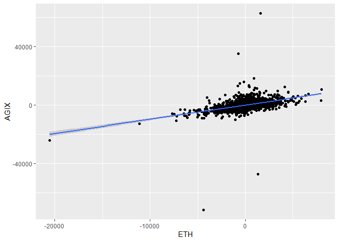<!-- -->

``` r
daily_annrets$AGIXresid = xts(resid(AGIXfit_daily), order.by=as.Date(names(resid(AGIXfit_daily))))

AGIXfit_weeks = lm(AGIX~ETH, data=weeks_annrets)
summary(AGIXfit_weeks)
```

    ## 
    ## Call:
    ## lm(formula = AGIX ~ ETH, data = weeks_annrets)
    ## 
    ## Residuals:
    ##     Min      1Q  Median      3Q     Max 
    ## -8079.8  -460.7   -49.6   363.1  8841.5 
    ## 
    ## Coefficients:
    ##              Estimate Std. Error t value Pr(>|t|)    
    ## (Intercept) -27.06993   61.47321   -0.44     0.66    
    ## ETH           0.92921    0.09173   10.13   <2e-16 ***
    ## ---
    ## Signif. codes:  0 '***' 0.001 '**' 0.01 '*' 0.05 '.' 0.1 ' ' 1
    ## 
    ## Residual standard error: 1084 on 309 degrees of freedom
    ##   (1 observation deleted due to missingness)
    ## Multiple R-squared:  0.2493, Adjusted R-squared:  0.2469 
    ## F-statistic: 102.6 on 1 and 309 DF,  p-value: < 2.2e-16

``` r
ggplot(weeks_annrets,aes(y=AGIX, x=ETH))+
  geom_point()+
  geom_smooth(method="lm")
```

    ## `geom_smooth()` using formula = 'y ~ x'

    ## Warning: Removed 1 rows containing non-finite values (`stat_smooth()`).
    ## Removed 1 rows containing missing values (`geom_point()`).

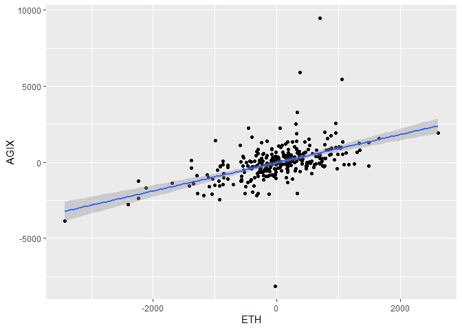<!-- -->

``` r
weeks_annrets$AGIXresids = xts(resid(AGIXfit_weeks), order.by=as.Date(names(resid(AGIXfit_weeks))))

AGIXfit_month = lm(AGIX~ETH, data=month_annrets)
summary(AGIXfit_month)
```

    ## 
    ## Call:
    ## lm(formula = AGIX ~ ETH, data = month_annrets)
    ## 
    ## Residuals:
    ##     Min      1Q  Median      3Q     Max 
    ## -618.18 -261.89  -32.82  160.35 1283.25 
    ## 
    ## Coefficients:
    ##             Estimate Std. Error t value Pr(>|t|)    
    ## (Intercept) -21.2910    45.3843  -0.469     0.64    
    ## ETH           0.9144     0.1349   6.779 3.33e-09 ***
    ## ---
    ## Signif. codes:  0 '***' 0.001 '**' 0.01 '*' 0.05 '.' 0.1 ' ' 1
    ## 
    ## Residual standard error: 381.9 on 69 degrees of freedom
    ##   (1 observation deleted due to missingness)
    ## Multiple R-squared:  0.3998, Adjusted R-squared:  0.3911 
    ## F-statistic: 45.96 on 1 and 69 DF,  p-value: 3.331e-09

``` r
ggplot(month_annrets,aes(y=AGIX, x=ETH))+
  geom_point()+
  geom_smooth(method="lm")
```

    ## `geom_smooth()` using formula = 'y ~ x'

    ## Warning: Removed 1 rows containing non-finite values (`stat_smooth()`).
    ## Removed 1 rows containing missing values (`geom_point()`).

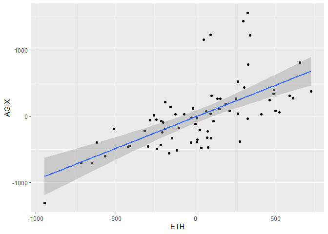<!-- -->

``` r
month_annrets2 = data.frame(date=names(resid(AGIXfit_month)))
month_annrets2$AGIXresids = resid(AGIXfit_month)
```

Next is the SingularityDAO token (SDAO):

``` r
SDAOfit_daily = lm(SDAO~ETH, data=daily_annrets)
summary(SDAOfit_daily)
```

    ## 
    ## Call:
    ## lm(formula = SDAO ~ ETH, data = daily_annrets)
    ## 
    ## Residuals:
    ##     Min      1Q  Median      3Q     Max 
    ## -9895.7 -1200.0  -110.4   994.7 16269.5 
    ## 
    ## Coefficients:
    ##             Estimate Std. Error t value Pr(>|t|)    
    ## (Intercept) -2.07474   75.01920  -0.028    0.978    
    ## ETH          0.96681    0.04982  19.406   <2e-16 ***
    ## ---
    ## Signif. codes:  0 '***' 0.001 '**' 0.01 '*' 0.05 '.' 0.1 ' ' 1
    ## 
    ## Residual standard error: 2351 on 980 degrees of freedom
    ##   (1197 observations deleted due to missingness)
    ## Multiple R-squared:  0.2776, Adjusted R-squared:  0.2769 
    ## F-statistic: 376.6 on 1 and 980 DF,  p-value: < 2.2e-16

``` r
ggplot(daily_annrets,aes(y=SDAO, x=ETH))+
  geom_point()+
  geom_smooth(method="lm")
```

    ## `geom_smooth()` using formula = 'y ~ x'

    ## Warning: Removed 1197 rows containing non-finite values (`stat_smooth()`).

    ## Warning: Removed 1197 rows containing missing values (`geom_point()`).

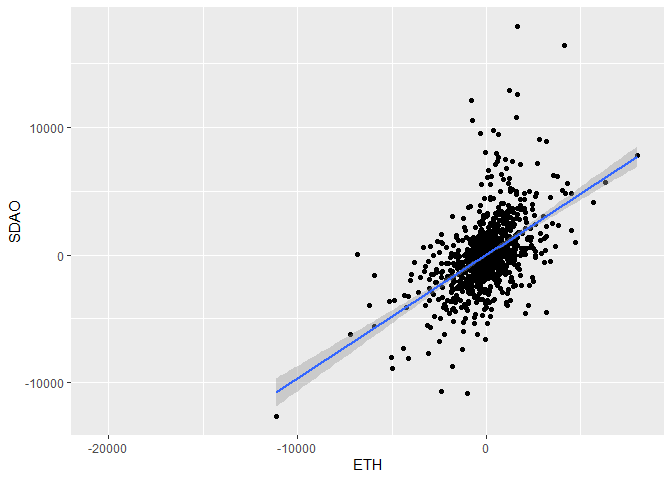<!-- -->

``` r
daily_annrets$SDAOresid = xts(resid(SDAOfit_daily), order.by=as.Date(names(resid(SDAOfit_daily))))

SDAOfit_weeks = lm(SDAO~ETH, data=weeks_annrets)
summary(SDAOfit_weeks)
```

    ## 
    ## Call:
    ## lm(formula = SDAO ~ ETH, data = weeks_annrets)
    ## 
    ## Residuals:
    ##     Min      1Q  Median      3Q     Max 
    ## -2178.2  -478.6  -151.8   370.5  4432.6 
    ## 
    ## Coefficients:
    ##             Estimate Std. Error t value Pr(>|t|)    
    ## (Intercept) -12.5921    78.9379  -0.160    0.873    
    ## ETH           0.8868     0.1367   6.489 1.44e-09 ***
    ## ---
    ## Signif. codes:  0 '***' 0.001 '**' 0.01 '*' 0.05 '.' 0.1 ' ' 1
    ## 
    ## Residual standard error: 933.7 on 138 degrees of freedom
    ##   (172 observations deleted due to missingness)
    ## Multiple R-squared:  0.2338, Adjusted R-squared:  0.2282 
    ## F-statistic:  42.1 on 1 and 138 DF,  p-value: 1.439e-09

``` r
ggplot(weeks_annrets,aes(y=SDAO, x=ETH))+
  geom_point()+
  geom_smooth(method="lm")
```

    ## `geom_smooth()` using formula = 'y ~ x'

    ## Warning: Removed 172 rows containing non-finite values (`stat_smooth()`).

    ## Warning: Removed 172 rows containing missing values (`geom_point()`).

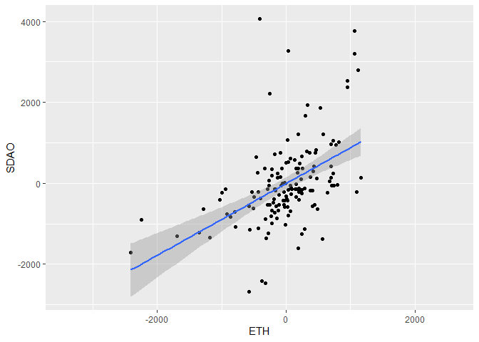<!-- -->

``` r
weeks_annrets$SDAOresids = xts(resid(SDAOfit_weeks), order.by=as.Date(names(resid(SDAOfit_weeks))))

SDAOfit_month = lm(SDAO~ETH, data=month_annrets)
summary(SDAOfit_month)
```

    ## 
    ## Call:
    ## lm(formula = SDAO ~ ETH, data = month_annrets)
    ## 
    ## Residuals:
    ##     Min      1Q  Median      3Q     Max 
    ## -637.68 -219.08  -48.27  154.11 1001.88 
    ## 
    ## Coefficients:
    ##             Estimate Std. Error t value Pr(>|t|)    
    ## (Intercept) -19.7866    65.4591  -0.302 0.764529    
    ## ETH           1.0158     0.2541   3.997 0.000385 ***
    ## ---
    ## Signif. codes:  0 '***' 0.001 '**' 0.01 '*' 0.05 '.' 0.1 ' ' 1
    ## 
    ## Residual standard error: 370.3 on 30 degrees of freedom
    ##   (40 observations deleted due to missingness)
    ## Multiple R-squared:  0.3475, Adjusted R-squared:  0.3257 
    ## F-statistic: 15.97 on 1 and 30 DF,  p-value: 0.0003852

``` r
ggplot(month_annrets,aes(y=SDAO, x=ETH))+
  geom_point()+
  geom_smooth(method="lm")
```

    ## `geom_smooth()` using formula = 'y ~ x'

    ## Warning: Removed 40 rows containing non-finite values (`stat_smooth()`).

    ## Warning: Removed 40 rows containing missing values (`geom_point()`).

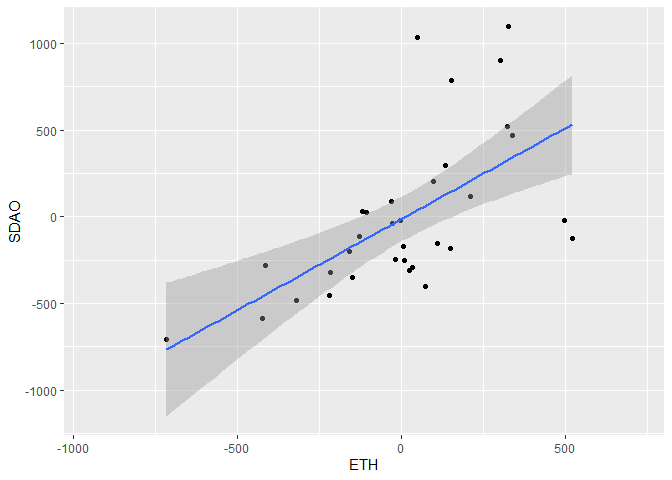<!-- -->

``` r
month_annrets3 = data.frame(date=names(resid(SDAOfit_month)))
month_annrets3$SDAOresids = resid(SDAOfit_month)
month_annrets2 = merge(month_annrets2, month_annrets3, all.x=TRUE)
```

Then the NuNet token (NTX):

``` r
NTXfit_daily = lm(NTX~ETH, data=daily_annrets)
summary(NTXfit_daily)
```

    ## 
    ## Call:
    ## lm(formula = NTX ~ ETH, data = daily_annrets)
    ## 
    ## Residuals:
    ##      Min       1Q   Median       3Q      Max 
    ## -11071.8  -1151.3    -35.7    927.0  16757.1 
    ## 
    ## Coefficients:
    ##              Estimate Std. Error t value Pr(>|t|)    
    ## (Intercept) -35.09730   87.06910  -0.403    0.687    
    ## ETH           0.91987    0.06523  14.102   <2e-16 ***
    ## ---
    ## Signif. codes:  0 '***' 0.001 '**' 0.01 '*' 0.05 '.' 0.1 ' ' 1
    ## 
    ## Residual standard error: 2436 on 781 degrees of freedom
    ##   (1396 observations deleted due to missingness)
    ## Multiple R-squared:  0.203,  Adjusted R-squared:  0.2019 
    ## F-statistic: 198.9 on 1 and 781 DF,  p-value: < 2.2e-16

``` r
ggplot(daily_annrets,aes(y=NTX, x=ETH))+
  geom_point()+
  geom_smooth(method="lm")
```

    ## `geom_smooth()` using formula = 'y ~ x'

    ## Warning: Removed 1396 rows containing non-finite values (`stat_smooth()`).

    ## Warning: Removed 1396 rows containing missing values (`geom_point()`).

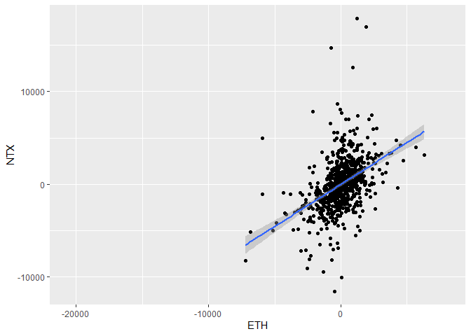<!-- -->

``` r
daily_annrets$NTXresid = xts(resid(NTXfit_daily), order.by=as.Date(names(resid(NTXfit_daily))))

NTXfit_weeks = lm(NTX~ETH, data=weeks_annrets)
summary(NTXfit_weeks)
```

    ## 
    ## Call:
    ## lm(formula = NTX ~ ETH, data = weeks_annrets)
    ## 
    ## Residuals:
    ##     Min      1Q  Median      3Q     Max 
    ## -2282.8  -476.3   -91.6   345.1  4167.1 
    ## 
    ## Coefficients:
    ##             Estimate Std. Error t value Pr(>|t|)    
    ## (Intercept) -34.5495    81.8205  -0.422    0.674    
    ## ETH           0.9417     0.1547   6.087 1.72e-08 ***
    ## ---
    ## Signif. codes:  0 '***' 0.001 '**' 0.01 '*' 0.05 '.' 0.1 ' ' 1
    ## 
    ## Residual standard error: 865.1 on 110 degrees of freedom
    ##   (200 observations deleted due to missingness)
    ## Multiple R-squared:  0.252,  Adjusted R-squared:  0.2451 
    ## F-statistic: 37.05 on 1 and 110 DF,  p-value: 1.718e-08

``` r
ggplot(weeks_annrets,aes(y=NTX, x=ETH))+
  geom_point()+
  geom_smooth(method="lm")
```

    ## `geom_smooth()` using formula = 'y ~ x'

    ## Warning: Removed 200 rows containing non-finite values (`stat_smooth()`).

    ## Warning: Removed 200 rows containing missing values (`geom_point()`).

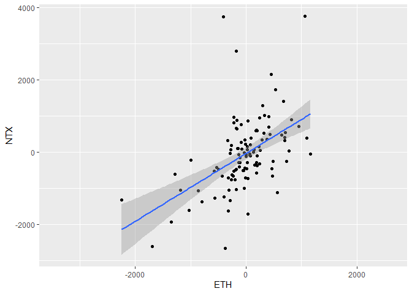<!-- -->

``` r
weeks_annrets$NTXresids = xts(resid(NTXfit_weeks), order.by=as.Date(names(resid(NTXfit_weeks))))

NTXfit_month = lm(NTX~ETH, data=month_annrets)
summary(NTXfit_month)
```

    ## 
    ## Call:
    ## lm(formula = NTX ~ ETH, data = month_annrets)
    ## 
    ## Residuals:
    ##     Min      1Q  Median      3Q     Max 
    ## -791.68 -225.33  -60.53  212.84 1115.41 
    ## 
    ## Coefficients:
    ##             Estimate Std. Error t value Pr(>|t|)    
    ## (Intercept) -32.2091    82.9205  -0.388 0.701119    
    ## ETH           1.2305     0.3236   3.803 0.000865 ***
    ## ---
    ## Signif. codes:  0 '***' 0.001 '**' 0.01 '*' 0.05 '.' 0.1 ' ' 1
    ## 
    ## Residual standard error: 420.5 on 24 degrees of freedom
    ##   (46 observations deleted due to missingness)
    ## Multiple R-squared:  0.376,  Adjusted R-squared:   0.35 
    ## F-statistic: 14.46 on 1 and 24 DF,  p-value: 0.0008653

``` r
ggplot(month_annrets,aes(y=NTX, x=ETH))+
  geom_point()+
  geom_smooth(method="lm")
```

    ## `geom_smooth()` using formula = 'y ~ x'

    ## Warning: Removed 46 rows containing non-finite values (`stat_smooth()`).

    ## Warning: Removed 46 rows containing missing values (`geom_point()`).

<!-- -->

``` r
month_annrets3 = data.frame(date=names(resid(NTXfit_month)))
month_annrets3$NTXresids = resid(NTXfit_month)
month_annrets2 = merge(month_annrets2, month_annrets3, all.x=TRUE)
```

Next is the Rejuve token (RJV):

``` r
RJVfit_daily = lm(RJV~ETH, data=daily_annrets)
summary(RJVfit_daily)
```

    ## 
    ## Call:
    ## lm(formula = RJV ~ ETH, data = daily_annrets)
    ## 
    ## Residuals:
    ##     Min      1Q  Median      3Q     Max 
    ## -8099.0 -1237.8   -81.1   944.7 11660.0 
    ## 
    ## Coefficients:
    ##              Estimate Std. Error t value Pr(>|t|)    
    ## (Intercept) -183.1318   129.4258  -1.415    0.158    
    ## ETH            0.7250     0.1476   4.913 1.46e-06 ***
    ## ---
    ## Signif. codes:  0 '***' 0.001 '**' 0.01 '*' 0.05 '.' 0.1 ' ' 1
    ## 
    ## Residual standard error: 2272 on 307 degrees of freedom
    ##   (1870 observations deleted due to missingness)
    ## Multiple R-squared:  0.0729, Adjusted R-squared:  0.06988 
    ## F-statistic: 24.14 on 1 and 307 DF,  p-value: 1.461e-06

``` r
ggplot(daily_annrets,aes(y=RJV, x=ETH))+
  geom_point()+
  geom_smooth(method="lm")
```

    ## `geom_smooth()` using formula = 'y ~ x'

    ## Warning: Removed 1870 rows containing non-finite values (`stat_smooth()`).

    ## Warning: Removed 1870 rows containing missing values (`geom_point()`).

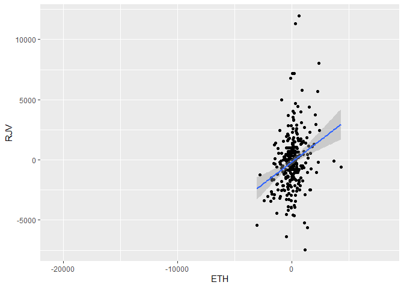<!-- -->

``` r
daily_annrets$RJVresid = xts(resid(RJVfit_daily), order.by=as.Date(names(resid(RJVfit_daily))))

RJVfit_weeks = lm(RJV~ETH, data=weeks_annrets)
summary(RJVfit_weeks)
```

    ## 
    ## Call:
    ## lm(formula = RJV ~ ETH, data = weeks_annrets)
    ## 
    ## Residuals:
    ##      Min       1Q   Median       3Q      Max 
    ## -2273.67  -397.54    -4.47   374.74  1880.34 
    ## 
    ## Coefficients:
    ##              Estimate Std. Error t value Pr(>|t|)   
    ## (Intercept) -211.0477   121.6970  -1.734  0.09022 . 
    ## ETH            1.3765     0.4332   3.177  0.00279 **
    ## ---
    ## Signif. codes:  0 '***' 0.001 '**' 0.01 '*' 0.05 '.' 0.1 ' ' 1
    ## 
    ## Residual standard error: 798.8 on 42 degrees of freedom
    ##   (268 observations deleted due to missingness)
    ## Multiple R-squared:  0.1938, Adjusted R-squared:  0.1746 
    ## F-statistic:  10.1 on 1 and 42 DF,  p-value: 0.002787

``` r
ggplot(weeks_annrets,aes(y=RJV, x=ETH))+
  geom_point()+
  geom_smooth(method="lm")
```

    ## `geom_smooth()` using formula = 'y ~ x'

    ## Warning: Removed 268 rows containing non-finite values (`stat_smooth()`).

    ## Warning: Removed 268 rows containing missing values (`geom_point()`).

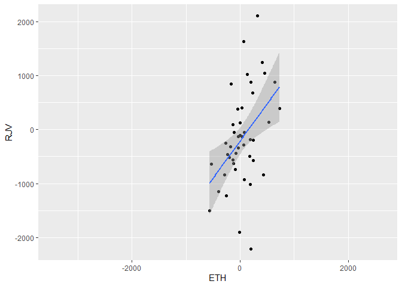<!-- -->

``` r
weeks_annrets$RJVresids = xts(resid(RJVfit_weeks), order.by=as.Date(names(resid(RJVfit_weeks))))

RJVfit_month = lm(RJV~ETH, data=month_annrets)
summary(RJVfit_month)
```

    ## 
    ## Call:
    ## lm(formula = RJV ~ ETH, data = month_annrets)
    ## 
    ## Residuals:
    ##     Min      1Q  Median      3Q     Max 
    ## -379.68 -306.53  -33.44  180.05  704.49 
    ## 
    ## Coefficients:
    ##             Estimate Std. Error t value Pr(>|t|)
    ## (Intercept) -195.740    130.076  -1.505    0.171
    ## ETH            1.868      1.473   1.268    0.240
    ## 
    ## Residual standard error: 368.1 on 8 degrees of freedom
    ##   (62 observations deleted due to missingness)
    ## Multiple R-squared:  0.1674, Adjusted R-squared:  0.06329 
    ## F-statistic: 1.608 on 1 and 8 DF,  p-value: 0.2404

``` r
ggplot(month_annrets,aes(y=RJV, x=ETH))+
  geom_point()+
  geom_smooth(method="lm")
```

    ## `geom_smooth()` using formula = 'y ~ x'

    ## Warning: Removed 62 rows containing non-finite values (`stat_smooth()`).

    ## Warning: Removed 62 rows containing missing values (`geom_point()`).

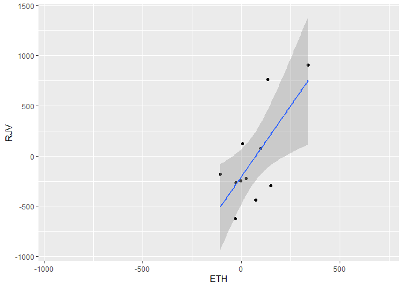<!-- -->

``` r
month_annrets3 = data.frame(date=names(resid(RJVfit_month)))
month_annrets3$RJVresids = resid(RJVfit_month)
month_annrets2 = merge(month_annrets2, month_annrets3, all.x=TRUE)
```

Then the HyperCycle token (HYPC):

``` r
HYPCfit_daily = lm(HYPC~ETH, data=daily_annrets)
summary(HYPCfit_daily)
```

    ## 
    ## Call:
    ## lm(formula = HYPC ~ ETH, data = daily_annrets)
    ## 
    ## Residuals:
    ##     Min      1Q  Median      3Q     Max 
    ## -6151.6  -930.8  -264.1   981.6 10369.3 
    ## 
    ## Coefficients:
    ##             Estimate Std. Error t value Pr(>|t|)    
    ## (Intercept)  55.9129   117.2030   0.477 0.633730    
    ## ETH           0.5055     0.1390   3.637 0.000334 ***
    ## ---
    ## Signif. codes:  0 '***' 0.001 '**' 0.01 '*' 0.05 '.' 0.1 ' ' 1
    ## 
    ## Residual standard error: 1873 on 254 degrees of freedom
    ##   (1923 observations deleted due to missingness)
    ## Multiple R-squared:  0.04949,    Adjusted R-squared:  0.04575 
    ## F-statistic: 13.23 on 1 and 254 DF,  p-value: 0.0003344

``` r
ggplot(daily_annrets,aes(y=HYPC, x=ETH))+
  geom_point()+
  geom_smooth(method="lm")
```

    ## `geom_smooth()` using formula = 'y ~ x'

    ## Warning: Removed 1923 rows containing non-finite values (`stat_smooth()`).

    ## Warning: Removed 1923 rows containing missing values (`geom_point()`).

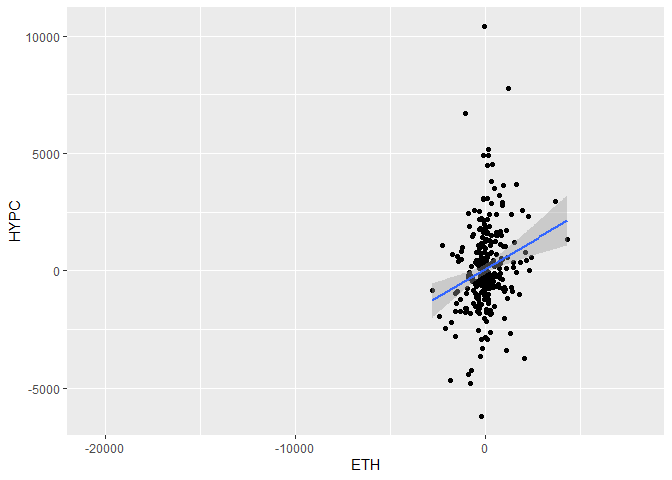<!-- -->

``` r
daily_annrets$HYPCresid = xts(resid(HYPCfit_daily), order.by=as.Date(names(resid(HYPCfit_daily))))

HYPCfit_weeks = lm(HYPC~ETH, data=weeks_annrets)
summary(HYPCfit_weeks)
```

    ## 
    ## Call:
    ## lm(formula = HYPC ~ ETH, data = weeks_annrets)
    ## 
    ## Residuals:
    ##      Min       1Q   Median       3Q      Max 
    ## -1107.46  -387.24   -79.98   207.31  3146.06 
    ## 
    ## Coefficients:
    ##              Estimate Std. Error t value Pr(>|t|)
    ## (Intercept) 121.32260  128.12214   0.947    0.350
    ## ETH           0.00747    0.47672   0.016    0.988
    ## 
    ## Residual standard error: 756.8 on 34 degrees of freedom
    ##   (276 observations deleted due to missingness)
    ## Multiple R-squared:  7.222e-06,  Adjusted R-squared:  -0.0294 
    ## F-statistic: 0.0002456 on 1 and 34 DF,  p-value: 0.9876

``` r
ggplot(weeks_annrets,aes(y=HYPC, x=ETH))+
  geom_point()+
  geom_smooth(method="lm")
```

    ## `geom_smooth()` using formula = 'y ~ x'

    ## Warning: Removed 276 rows containing non-finite values (`stat_smooth()`).

    ## Warning: Removed 276 rows containing missing values (`geom_point()`).

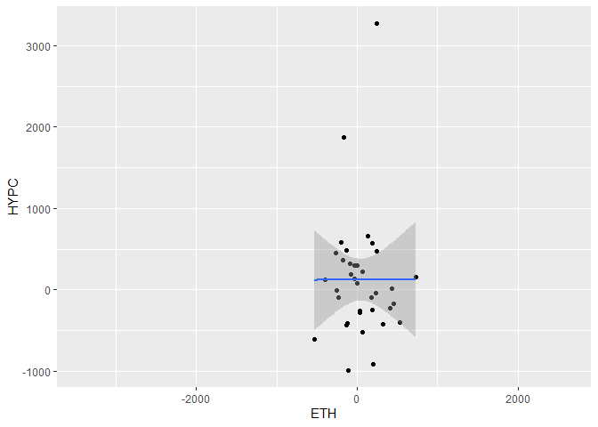<!-- -->

``` r
weeks_annrets$HYPCresids = xts(resid(HYPCfit_weeks), order.by=as.Date(names(resid(HYPCfit_weeks))))

HYPCfit_month = lm(HYPC~ETH, data=month_annrets)
summary(HYPCfit_month)
```

    ## 
    ## Call:
    ## lm(formula = HYPC ~ ETH, data = month_annrets)
    ## 
    ## Residuals:
    ##     Min      1Q  Median      3Q     Max 
    ## -573.75 -162.10  -59.76  129.33  626.13 
    ## 
    ## Coefficients:
    ##             Estimate Std. Error t value Pr(>|t|)
    ## (Intercept)  226.046    161.381   1.401    0.211
    ## ETH           -2.319      1.694  -1.369    0.220
    ## 
    ## Residual standard error: 413.3 on 6 degrees of freedom
    ##   (64 observations deleted due to missingness)
    ## Multiple R-squared:  0.2381, Adjusted R-squared:  0.1111 
    ## F-statistic: 1.875 on 1 and 6 DF,  p-value: 0.22

``` r
ggplot(month_annrets,aes(y=HYPC, x=ETH))+
  geom_point()+
  geom_smooth(method="lm")
```

    ## `geom_smooth()` using formula = 'y ~ x'

    ## Warning: Removed 64 rows containing non-finite values (`stat_smooth()`).

    ## Warning: Removed 64 rows containing missing values (`geom_point()`).

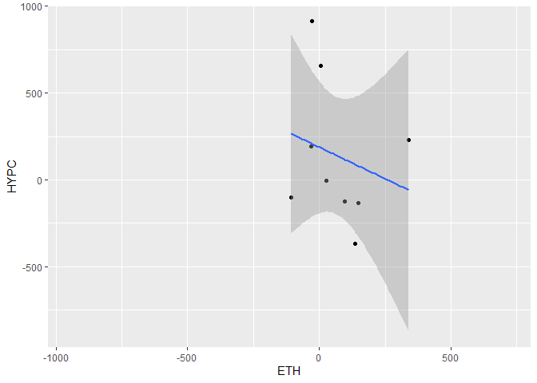<!-- -->

``` r
month_annrets3 = data.frame(date=names(resid(HYPCfit_month)))
month_annrets3$HYPCresids = resid(HYPCfit_month)
month_annrets2 = merge(month_annrets2, month_annrets3, all.x=TRUE)
```

Next is the Cogito token (CGV):

``` r
CGVfit_daily = lm(CGV~ETH, data=daily_annrets)
summary(CGVfit_daily)
```

    ## 
    ## Call:
    ## lm(formula = CGV ~ ETH, data = daily_annrets)
    ## 
    ## Residuals:
    ##     Min      1Q  Median      3Q     Max 
    ## -5943.6  -557.9  -102.3   425.3 10167.0 
    ## 
    ## Coefficients:
    ##             Estimate Std. Error t value Pr(>|t|)    
    ## (Intercept) -92.6080   107.0426  -0.865 0.387903    
    ## ETH           0.4765     0.1234   3.860 0.000149 ***
    ## ---
    ## Signif. codes:  0 '***' 0.001 '**' 0.01 '*' 0.05 '.' 0.1 ' ' 1
    ## 
    ## Residual standard error: 1588 on 219 degrees of freedom
    ##   (1958 observations deleted due to missingness)
    ## Multiple R-squared:  0.06371,    Adjusted R-squared:  0.05944 
    ## F-statistic:  14.9 on 1 and 219 DF,  p-value: 0.000149

``` r
ggplot(daily_annrets,aes(y=CGV, x=ETH))+
  geom_point()+
  geom_smooth(method="lm")
```

    ## `geom_smooth()` using formula = 'y ~ x'

    ## Warning: Removed 1958 rows containing non-finite values (`stat_smooth()`).

    ## Warning: Removed 1958 rows containing missing values (`geom_point()`).

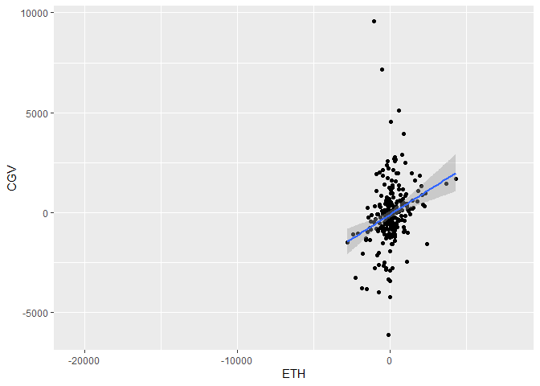<!-- -->

``` r
daily_annrets$CGVresid = xts(resid(CGVfit_daily), order.by=as.Date(names(resid(CGVfit_daily))))

CGVfit_weeks = lm(CGV~ETH, data=weeks_annrets)
summary(CGVfit_weeks)
```

    ## 
    ## Call:
    ## lm(formula = CGV ~ ETH, data = weeks_annrets)
    ## 
    ## Residuals:
    ##      Min       1Q   Median       3Q      Max 
    ## -1050.21  -281.23   -32.51   209.67  2380.43 
    ## 
    ## Coefficients:
    ##             Estimate Std. Error t value Pr(>|t|)
    ## (Intercept) -90.7719   111.5613  -0.814    0.422
    ## ETH           0.5214     0.4006   1.301    0.203
    ## 
    ## Residual standard error: 605.8 on 29 degrees of freedom
    ##   (281 observations deleted due to missingness)
    ## Multiple R-squared:  0.05517,    Adjusted R-squared:  0.02259 
    ## F-statistic: 1.693 on 1 and 29 DF,  p-value: 0.2034

``` r
ggplot(weeks_annrets,aes(y=CGV, x=ETH))+
  geom_point()+
  geom_smooth(method="lm")
```

    ## `geom_smooth()` using formula = 'y ~ x'

    ## Warning: Removed 281 rows containing non-finite values (`stat_smooth()`).

    ## Warning: Removed 281 rows containing missing values (`geom_point()`).

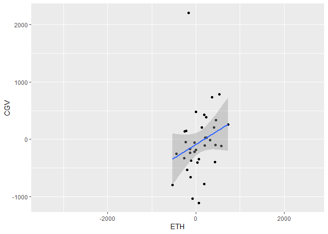<!-- -->

``` r
weeks_annrets$CGVresids = xts(resid(CGVfit_weeks), order.by=as.Date(names(resid(CGVfit_weeks))))

CGVfit_month = lm(CGV~ETH, data=month_annrets)
summary(CGVfit_month)
```

    ## 
    ## Call:
    ## lm(formula = CGV ~ ETH, data = month_annrets)
    ## 
    ## Residuals:
    ## Jul 2023 Aug 2023 Sep 2023 Oct 2023 Nov 2023 Dec 2023 Jan 2024 
    ##   160.19  -178.80   188.17  -102.04    67.17   -13.48  -121.22 
    ## 
    ## Coefficients:
    ##              Estimate Std. Error t value Pr(>|t|)  
    ## (Intercept) -151.0924    68.4007  -2.209   0.0782 .
    ## ETH            2.1737     0.6759   3.216   0.0236 *
    ## ---
    ## Signif. codes:  0 '***' 0.001 '**' 0.01 '*' 0.05 '.' 0.1 ' ' 1
    ## 
    ## Residual standard error: 156.7 on 5 degrees of freedom
    ##   (65 observations deleted due to missingness)
    ## Multiple R-squared:  0.6741, Adjusted R-squared:  0.6089 
    ## F-statistic: 10.34 on 1 and 5 DF,  p-value: 0.02357

``` r
ggplot(month_annrets,aes(y=CGV, x=ETH))+
  geom_point()+
  geom_smooth(method="lm")
```

    ## `geom_smooth()` using formula = 'y ~ x'

    ## Warning: Removed 65 rows containing non-finite values (`stat_smooth()`).

    ## Warning: Removed 65 rows containing missing values (`geom_point()`).

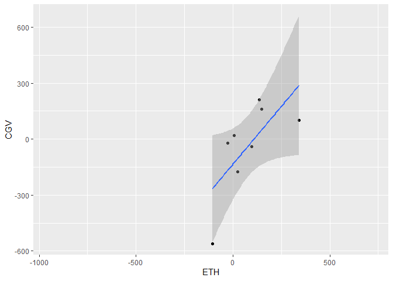<!-- -->

``` r
month_annrets3 = data.frame(date=names(resid(CGVfit_month)))
month_annrets3$CGVresids = resid(CGVfit_month)
month_annrets2 = merge(month_annrets2, month_annrets3, all.x=TRUE)
```

Lastly is the Sophiaverse token (SOPH):

``` r
SOPHfit_daily = lm(SOPH~ETH, data=daily_annrets)
summary(SOPHfit_daily)
```

    ## 
    ## Call:
    ## lm(formula = SOPH ~ ETH, data = daily_annrets)
    ## 
    ## Residuals:
    ##     Min      1Q  Median      3Q     Max 
    ## -6258.3 -1095.8  -125.2   768.9 19757.4 
    ## 
    ## Coefficients:
    ##              Estimate Std. Error t value Pr(>|t|)
    ## (Intercept) -178.4249   194.1034  -0.919    0.359
    ## ETH            0.3299     0.2194   1.504    0.134
    ## 
    ## Residual standard error: 2584 on 176 degrees of freedom
    ##   (2001 observations deleted due to missingness)
    ## Multiple R-squared:  0.01269,    Adjusted R-squared:  0.007078 
    ## F-statistic: 2.262 on 1 and 176 DF,  p-value: 0.1344

``` r
ggplot(daily_annrets,aes(y=SOPH, x=ETH))+
  geom_point()+
  geom_smooth(method="lm")
```

    ## `geom_smooth()` using formula = 'y ~ x'

    ## Warning: Removed 2001 rows containing non-finite values (`stat_smooth()`).

    ## Warning: Removed 2001 rows containing missing values (`geom_point()`).

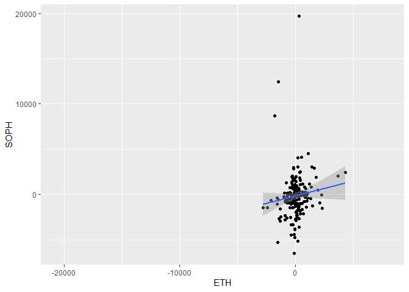<!-- -->

``` r
daily_annrets$SOPHresid = xts(resid(SOPHfit_daily), order.by=as.Date(names(resid(SOPHfit_daily))))

SOPHfit_weeks = lm(SOPH~ETH, data=weeks_annrets)
summary(SOPHfit_weeks)
```

    ## 
    ## Call:
    ## lm(formula = SOPH ~ ETH, data = weeks_annrets)
    ## 
    ## Residuals:
    ##      Min       1Q   Median       3Q      Max 
    ## -1872.93  -197.46   -89.74   205.05  1585.89 
    ## 
    ## Coefficients:
    ##              Estimate Std. Error t value Pr(>|t|)  
    ## (Intercept) -280.1021   135.1204  -2.073   0.0496 *
    ## ETH            0.1773     0.4668   0.380   0.7076  
    ## ---
    ## Signif. codes:  0 '***' 0.001 '**' 0.01 '*' 0.05 '.' 0.1 ' ' 1
    ## 
    ## Residual standard error: 661.7 on 23 degrees of freedom
    ##   (287 observations deleted due to missingness)
    ## Multiple R-squared:  0.006233,   Adjusted R-squared:  -0.03697 
    ## F-statistic: 0.1443 on 1 and 23 DF,  p-value: 0.7076

``` r
ggplot(weeks_annrets,aes(y=SOPH, x=ETH))+
  geom_point()+
  geom_smooth(method="lm")
```

    ## `geom_smooth()` using formula = 'y ~ x'

    ## Warning: Removed 287 rows containing non-finite values (`stat_smooth()`).

    ## Warning: Removed 287 rows containing missing values (`geom_point()`).

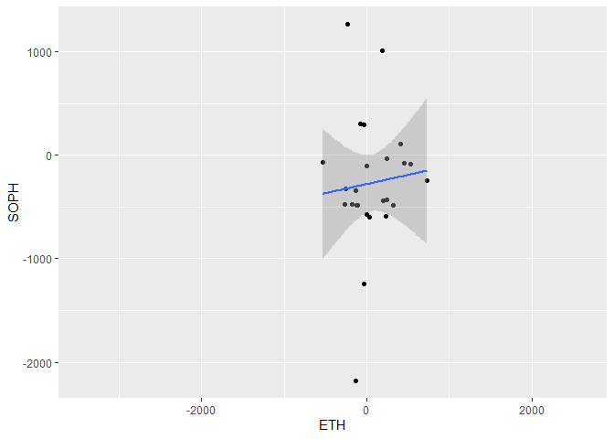<!-- -->

``` r
weeks_annrets$SOPHresids = xts(resid(SOPHfit_weeks), order.by=as.Date(names(resid(SOPHfit_weeks))))

SOPHfit_month = lm(SOPH~ETH, data=month_annrets)
summary(SOPHfit_month)
```

    ## 
    ## Call:
    ## lm(formula = SOPH ~ ETH, data = month_annrets)
    ## 
    ## Residuals:
    ## Aug 2023 Sep 2023 Oct 2023 Nov 2023 Dec 2023 Jan 2024 
    ##    11.56    21.48   -62.01    48.06    62.63   -81.72 
    ## 
    ## Coefficients:
    ##              Estimate Std. Error t value Pr(>|t|)    
    ## (Intercept) -292.1302    31.7471  -9.202 0.000775 ***
    ## ETH            0.9973     0.2905   3.433 0.026460 *  
    ## ---
    ## Signif. codes:  0 '***' 0.001 '**' 0.01 '*' 0.05 '.' 0.1 ' ' 1
    ## 
    ## Residual standard error: 65.86 on 4 degrees of freedom
    ##   (66 observations deleted due to missingness)
    ## Multiple R-squared:  0.7466, Adjusted R-squared:  0.6833 
    ## F-statistic: 11.79 on 1 and 4 DF,  p-value: 0.02646

``` r
ggplot(month_annrets,aes(y=SOPH, x=ETH))+
  geom_point()+
  geom_smooth(method="lm")
```

    ## `geom_smooth()` using formula = 'y ~ x'

    ## Warning: Removed 66 rows containing non-finite values (`stat_smooth()`).

    ## Warning: Removed 66 rows containing missing values (`geom_point()`).

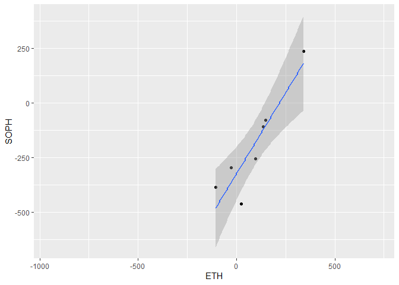<!-- -->

``` r
month_annrets3 = data.frame(date=names(resid(SOPHfit_month)))
month_annrets3$SOPHresids = resid(SOPHfit_month)
month_annrets2 = merge(month_annrets2, month_annrets3, all.x=TRUE)
```

Lastly, let’s look at the ecosystem as a whole:

``` r
SNETfit_daily = lm(SNET~ETH, data=daily_annrets)
summary(SNETfit_daily)
```

    ## 
    ## Call:
    ## lm(formula = SNET ~ ETH, data = daily_annrets)
    ## 
    ## Residuals:
    ##    Min     1Q Median     3Q    Max 
    ## -67726  -1109   -107    937  64728 
    ## 
    ## Coefficients:
    ##             Estimate Std. Error t value Pr(>|t|)    
    ## (Intercept) -5.11840   64.72171  -0.079    0.937    
    ## ETH          0.91335    0.03773  24.209   <2e-16 ***
    ## ---
    ## Signif. codes:  0 '***' 0.001 '**' 0.01 '*' 0.05 '.' 0.1 ' ' 1
    ## 
    ## Residual standard error: 3020 on 2176 degrees of freedom
    ##   (1 observation deleted due to missingness)
    ## Multiple R-squared:  0.2122, Adjusted R-squared:  0.2118 
    ## F-statistic: 586.1 on 1 and 2176 DF,  p-value: < 2.2e-16

``` r
ggplot(daily_annrets,aes(y=SNET, x=ETH))+
  geom_point()+
  geom_smooth(method="lm")
```

    ## `geom_smooth()` using formula = 'y ~ x'

    ## Warning: Removed 1 rows containing non-finite values (`stat_smooth()`).

    ## Warning: Removed 1 rows containing missing values (`geom_point()`).

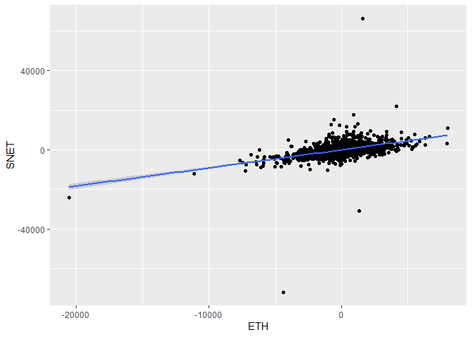<!-- -->

``` r
daily_annrets$SNETresid = xts(resid(SNETfit_daily), order.by=as.Date(names(resid(SNETfit_daily))))

SNETfit_weeks = lm(SNET~ETH, data=weeks_annrets)
summary(SNETfit_weeks)
```

    ## 
    ## Call:
    ## lm(formula = SNET ~ ETH, data = weeks_annrets)
    ## 
    ## Residuals:
    ##     Min      1Q  Median      3Q     Max 
    ## -8648.1  -456.1   -63.4   339.4 10096.6 
    ## 
    ## Coefficients:
    ##             Estimate Std. Error t value Pr(>|t|)    
    ## (Intercept) -5.61959   64.30109  -0.087     0.93    
    ## ETH          0.87193    0.09595   9.087   <2e-16 ***
    ## ---
    ## Signif. codes:  0 '***' 0.001 '**' 0.01 '*' 0.05 '.' 0.1 ' ' 1
    ## 
    ## Residual standard error: 1134 on 309 degrees of freedom
    ##   (1 observation deleted due to missingness)
    ## Multiple R-squared:  0.2109, Adjusted R-squared:  0.2083 
    ## F-statistic: 82.57 on 1 and 309 DF,  p-value: < 2.2e-16

``` r
ggplot(weeks_annrets,aes(y=SNET, x=ETH))+
  geom_point()+
  geom_smooth(method="lm")
```

    ## `geom_smooth()` using formula = 'y ~ x'

    ## Warning: Removed 1 rows containing non-finite values (`stat_smooth()`).
    ## Removed 1 rows containing missing values (`geom_point()`).

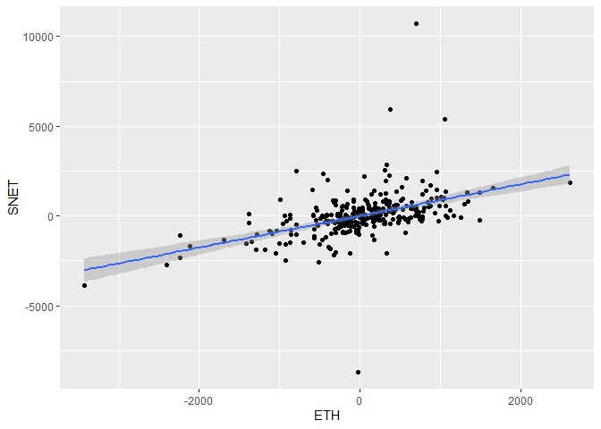<!-- -->

``` r
weeks_annrets$SNETresids = xts(resid(SNETfit_weeks), order.by=as.Date(names(resid(SNETfit_weeks))))

SNETfit_month = lm(SNET~ETH, data=month_annrets)
summary(SNETfit_month)
```

    ## 
    ## Call:
    ## lm(formula = SNET ~ ETH, data = month_annrets)
    ## 
    ## Residuals:
    ##     Min      1Q  Median      3Q     Max 
    ## -599.81 -223.16  -41.21  115.91 1239.98 
    ## 
    ## Coefficients:
    ##             Estimate Std. Error t value Pr(>|t|)    
    ## (Intercept)   0.7395    44.7925   0.017    0.987    
    ## ETH           0.8259     0.1331   6.204 3.56e-08 ***
    ## ---
    ## Signif. codes:  0 '***' 0.001 '**' 0.01 '*' 0.05 '.' 0.1 ' ' 1
    ## 
    ## Residual standard error: 376.9 on 69 degrees of freedom
    ##   (1 observation deleted due to missingness)
    ## Multiple R-squared:  0.3581, Adjusted R-squared:  0.3488 
    ## F-statistic: 38.49 on 1 and 69 DF,  p-value: 3.56e-08

``` r
ggplot(month_annrets,aes(y=SNET, x=ETH))+
  geom_point()+
  geom_smooth(method="lm")
```

    ## `geom_smooth()` using formula = 'y ~ x'

    ## Warning: Removed 1 rows containing non-finite values (`stat_smooth()`).
    ## Removed 1 rows containing missing values (`geom_point()`).

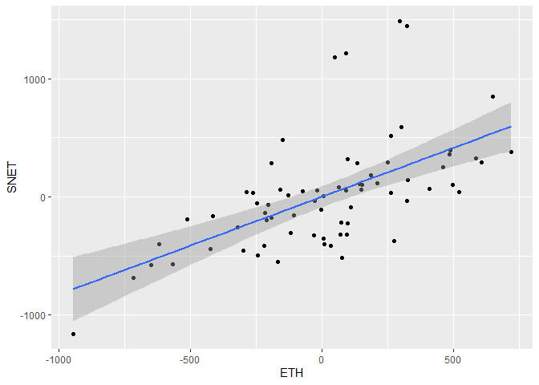<!-- -->

``` r
month_annrets3 = data.frame(date=names(resid(SNETfit_month)))
month_annrets3$SNETresids = resid(SNETfit_month)
month_annrets2 = merge(month_annrets2, month_annrets3, all.x=TRUE)
```

### Residual Correlations

Now that we have the residual series for each of the coins/tokens, let’s
look at the correlations between them. These represent the correlations
of the asset returns after removing the effects that are explained by
their relationship with Ethereum.

``` r
cor(daily_annrets[,10:17], use="pairwise.complete.obs") |> round(2)
```

    ##           AGIXresid SDAOresid NTXresid RJVresid HYPCresid CGVresid SOPHresid
    ## AGIXresid      1.00      0.23     0.35     0.18      0.07     0.15      0.08
    ## SDAOresid      0.23      1.00     0.37     0.14     -0.05     0.06      0.03
    ## NTXresid       0.35      0.37     1.00     0.17      0.05     0.12      0.00
    ## RJVresid       0.18      0.14     0.17     1.00      0.10     0.20      0.02
    ## HYPCresid      0.07     -0.05     0.05     0.10      1.00     0.20      0.04
    ## CGVresid       0.15      0.06     0.12     0.20      0.20     1.00     -0.02
    ## SOPHresid      0.08      0.03     0.00     0.02      0.04    -0.02      1.00
    ## SNETresid      0.93      0.30     0.41     0.22      0.07     0.16      0.11
    ##           SNETresid
    ## AGIXresid      0.93
    ## SDAOresid      0.30
    ## NTXresid       0.41
    ## RJVresid       0.22
    ## HYPCresid      0.07
    ## CGVresid       0.16
    ## SOPHresid      0.11
    ## SNETresid      1.00

``` r
cor(weeks_annrets[,10:17], use="pairwise.complete.obs") |> round(2)
```

    ##            AGIXresids SDAOresids NTXresids RJVresids HYPCresids CGVresids
    ## AGIXresids       1.00       0.36      0.55      0.43      -0.02      0.00
    ## SDAOresids       0.36       1.00      0.63      0.25      -0.03      0.24
    ## NTXresids        0.55       0.63      1.00      0.25      -0.03      0.30
    ## RJVresids        0.43       0.25      0.25      1.00      -0.05      0.31
    ## HYPCresids      -0.02      -0.03     -0.03     -0.05       1.00      0.35
    ## CGVresids        0.00       0.24      0.30      0.31       0.35      1.00
    ## SOPHresids       0.19      -0.05      0.11     -0.31       0.01      0.04
    ## SNETresids       0.97       0.29      0.61      0.44      -0.03      0.06
    ##            SOPHresids SNETresids
    ## AGIXresids       0.19       0.97
    ## SDAOresids      -0.05       0.29
    ## NTXresids        0.11       0.61
    ## RJVresids       -0.31       0.44
    ## HYPCresids       0.01      -0.03
    ## CGVresids        0.04       0.06
    ## SOPHresids       1.00       0.20
    ## SNETresids       0.20       1.00

``` r
cor(month_annrets2[,-1], use="pairwise.complete.obs") |> round(2)
```

    ##            AGIXresids SDAOresids NTXresids RJVresids HYPCresids CGVresids
    ## AGIXresids       1.00       0.66      0.84      0.65       0.00      0.25
    ## SDAOresids       0.66       1.00      0.67      0.55      -0.41     -0.04
    ## NTXresids        0.84       0.67      1.00      0.56      -0.02      0.19
    ## RJVresids        0.65       0.55      0.56      1.00      -0.17      0.22
    ## HYPCresids       0.00      -0.41     -0.02     -0.17       1.00      0.80
    ## CGVresids        0.25      -0.04      0.19      0.22       0.80      1.00
    ## SOPHresids       0.30       0.15     -0.16      0.15      -0.02      0.51
    ## SNETresids       0.94       0.56      0.87      0.70      -0.04      0.24
    ##            SOPHresids SNETresids
    ## AGIXresids       0.30       0.94
    ## SDAOresids       0.15       0.56
    ## NTXresids       -0.16       0.87
    ## RJVresids        0.15       0.70
    ## HYPCresids      -0.02      -0.04
    ## CGVresids        0.51       0.24
    ## SOPHresids       1.00       0.24
    ## SNETresids       0.24       1.00
