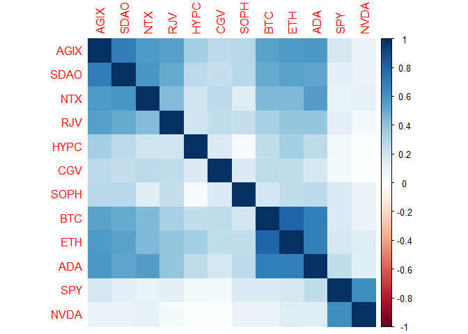
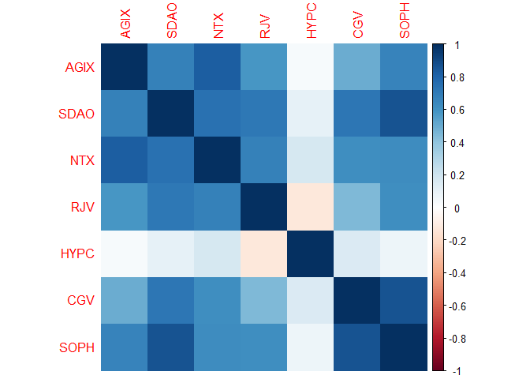

SingularityNET Ecosystem Analysis
================
Last updated: 2024-06-25

## Preliminary Work: Install/Load Packages

To try and ensure that this R Notebook will run successfully, we’ll use
the [renv
package](https://cran.r-project.org/web/packages/renv/index.html) to
create a project-specific library of packages. This will allow us to
install the packages that we need for this project without affecting any
other projects that we may be working on. Additionally, the project
library will track the specific versions of the dependency packages so
that any updates to those packages will not break this project.

The code chunk below will first install the renv package if it is not
already installed. Then we will load the package. Next, we’ll use the
`restore()` function to install any packages listed in the renv.lock
file. Once these packages are installed, we can load them into the R
session using the `library()` commands. Below the code chunk, we’ll list
out the packages that will be used in the project demo. And if you run
into any trouble using renv, then you can use the second code chunk
below and that should be an even more reliable approach to install the
required packages.

``` r
# Install renv package if not already installed
if(!"renv" %in% installed.packages()[,"Package"]) install.packages("renv")
# Load renv package
library(renv)
# Use restore() to install any packages listed in the renv.lock file
renv::restore(clean=TRUE, lockfile="../renv.lock")
# Load in the packages
library(quantmod)
library(tidyverse)
library(scales)
library(corrplot)
library(stargazer)
library(rmarkdown)
```

- The [quantmod package](https://cran.r-project.org/package=quantmod)
  contains tools for importing and analyzing financial data.
- The [tidyverse package](https://www.tidyverse.org/) contains a suite
  of packages for data manipulation and visualization.
- The [scales package](https://cran.r-project.org/package=scales)
- The [corrplot package](https://cran.r-project.org/package=corrplot)
  lets us create correlation plots.
- The [rmarkdown package](https://cran.r-project.org/package=rmarkdown)
  is used to g

Since the rmarkdown functionality is built into RStudio, this one is
automatically loaded when we open the RStudio. So no need to use the
`library()` function for this one. Another observation to make about the
code chunk above is that it is labeled as ‘setup’, which is a special
name, which the R Notebook will recognize and automatically run prior to
running any other code chunk. This is useful for loading in packages and
setting up other global options that will be used throughout the
notebook.

Then if you wish to try and update the versions of the various R
packages in the lock file, you can use the `renv::update()` function to
update the packages in the project library. However, it is possible that
these updates could break the code in this notebook. If so, you may need
to adapt the code to work with the updated packages.

My recommendation is to first run through the code using the versions of
the packages in the lock file. Then if you want to try and update the
packages, you can do so and then run through the code again to see if it
still works. If not, you can always revert back to the lock file
versions using the `renv::restore()` function.

If you update the packages and get everything working successfully, then
you can update the lock file using the `renv::snapshot()` function. This
will update the lock file with the versions of the packages that are
currently installed in the project library. Then you can commit the
updated lock file to the repository so that others can use the updated
versions of the packages.

### Alternative Package Installation Code

If you run into any trouble using renv in the code chunk above, then you
can use the code chunk below to install the required packages for this
analysis. This method will first check if you have already installed the
packages. If any are missing, it will then install them. Then it will
load the packages into the R session. A potential flaw in this approach
compared to using renv is that it will simply install the latest
versions of the packages, which could potentially break some of the code
in this notebook if any of the updates aren’t backwards compatible.

As long as you have downloaded the entire project repository, the renv
chunk above will likely be managing the packages. Thus, the `eval=FALSE`
option is used to prevent this chunk from running unless manually
executed. So if you only downloaded this one Rmd file, this code chunk
should take care of installing the packages for you.

``` r
# Create list of packages needed for this exercise, omit geckor since its not on CRAN
list.of.packages = c("quantmod","tidyverse","scales","corrplot","rmarkdown")
# Check if any have not yet been installed
new.packages = list.of.packages[!(list.of.packages %in% installed.packages()[,"Package"])]
# If any need to be installed, install them
if(length(new.packages)) install.packages(new.packages)
library(quantmod)
library(tidyverse)
library(scales)
library(corrplot)
library(rmarkdown)
```

## Data Import and Cleaning

### Token Price Data

First, let’s import the price data for all the SingularityNET ecosystem
tokens, as well as the price data for Bitcoin (BTC), Ethereum (ETH),
Cardano (ADA), an S&P 500 ETF (SPY), and Nvidia stock (NVDA). These
additional assets will allow us to compare these SingularityNET tokens
with some other related assets. We’ll use the `getSymbols()` function
from the quantmod package to import the price data for these assets.
This will download the price data from Yahoo Finance and store it in the
R environment as xts objects.

``` r
startdate = "2018-01-19" # begin at start of AGIX price series
tickers = c("AGIX-USD",
            "SDAO-USD",
            "NTX13198-USD", # Nunet token has a numeric code in the name to distinguish from NitroEX USD
            "RJV-USD",
            "HYPC-USD",
            "CGV-USD",
            "SOPH-USD",
            "BTC-USD",
            "ETH-USD",
            "ADA-USD",
            "SPY",
            "NVDA")
getSymbols(tickers,
           src="yahoo",
           from=startdate,
           to=Sys.Date())
```

As of June 2024, several tokens generate warning messages about some
missing values in the data. So let’s diagnose these issues. The code
chunk below will use the `complete.cases()` function to identify the
rows with missing values for each of the tokens.

``` r
`AGIX-USD`[!complete.cases(`AGIX-USD`),]
```

    ##            AGIX-USD.Open AGIX-USD.High AGIX-USD.Low AGIX-USD.Close
    ## 2024-06-25            NA            NA           NA             NA
    ##            AGIX-USD.Volume AGIX-USD.Adjusted
    ## 2024-06-25              NA                NA

``` r
`SDAO-USD`[!complete.cases(`SDAO-USD`),]
```

    ##            SDAO-USD.Open SDAO-USD.High SDAO-USD.Low SDAO-USD.Close
    ## 2024-06-25            NA            NA           NA             NA
    ##            SDAO-USD.Volume SDAO-USD.Adjusted
    ## 2024-06-25              NA                NA

``` r
`NTX13198-USD`[!complete.cases(`NTX13198-USD`),]
```

    ##            NTX13198-USD.Open NTX13198-USD.High NTX13198-USD.Low
    ## 2024-06-25                NA                NA               NA
    ##            NTX13198-USD.Close NTX13198-USD.Volume NTX13198-USD.Adjusted
    ## 2024-06-25                 NA                  NA                    NA

``` r
`RJV-USD`[!complete.cases(`RJV-USD`),]
```

    ##            RJV-USD.Open RJV-USD.High RJV-USD.Low RJV-USD.Close RJV-USD.Volume
    ## 2024-06-25           NA           NA          NA            NA             NA
    ##            RJV-USD.Adjusted
    ## 2024-06-25               NA

``` r
`HYPC-USD`[!complete.cases(`HYPC-USD`),]
```

    ##            HYPC-USD.Open HYPC-USD.High HYPC-USD.Low HYPC-USD.Close
    ## 2023-09-18            NA            NA           NA             NA
    ## 2023-09-19            NA            NA           NA             NA
    ## 2023-09-20            NA            NA           NA             NA
    ## 2024-06-25            NA            NA           NA             NA
    ##            HYPC-USD.Volume HYPC-USD.Adjusted
    ## 2023-09-18              NA                NA
    ## 2023-09-19              NA                NA
    ## 2023-09-20              NA                NA
    ## 2024-06-25              NA                NA

``` r
`CGV-USD`[!complete.cases(`CGV-USD`),]
```

    ##            CGV-USD.Open CGV-USD.High CGV-USD.Low CGV-USD.Close CGV-USD.Volume
    ## 2023-09-18           NA           NA          NA            NA             NA
    ## 2023-09-19           NA           NA          NA            NA             NA
    ## 2023-09-20           NA           NA          NA            NA             NA
    ## 2024-06-25           NA           NA          NA            NA             NA
    ##            CGV-USD.Adjusted
    ## 2023-09-18               NA
    ## 2023-09-19               NA
    ## 2023-09-20               NA
    ## 2024-06-25               NA

``` r
`SOPH-USD`[!complete.cases(`SOPH-USD`),]
```

    ##            SOPH-USD.Open SOPH-USD.High SOPH-USD.Low SOPH-USD.Close
    ## 2023-09-18            NA            NA           NA             NA
    ## 2023-09-19            NA            NA           NA             NA
    ## 2023-09-20            NA            NA           NA             NA
    ## 2024-06-25            NA            NA           NA             NA
    ##            SOPH-USD.Volume SOPH-USD.Adjusted
    ## 2023-09-18              NA                NA
    ## 2023-09-19              NA                NA
    ## 2023-09-20              NA                NA
    ## 2024-06-25              NA                NA

``` r
`BTC-USD`[!complete.cases(`BTC-USD`),]
```

    ##            BTC-USD.Open BTC-USD.High BTC-USD.Low BTC-USD.Close BTC-USD.Volume
    ## 2024-06-25           NA           NA          NA            NA             NA
    ##            BTC-USD.Adjusted
    ## 2024-06-25               NA

``` r
`ETH-USD`[!complete.cases(`ETH-USD`),]
```

    ##            ETH-USD.Open ETH-USD.High ETH-USD.Low ETH-USD.Close ETH-USD.Volume
    ## 2024-06-25           NA           NA          NA            NA             NA
    ##            ETH-USD.Adjusted
    ## 2024-06-25               NA

``` r
`ADA-USD`[!complete.cases(`ADA-USD`),]
```

    ##            ADA-USD.Open ADA-USD.High ADA-USD.Low ADA-USD.Close ADA-USD.Volume
    ## 2024-06-25           NA           NA          NA            NA             NA
    ##            ADA-USD.Adjusted
    ## 2024-06-25               NA

``` r
SPY[!complete.cases(SPY),]
```

    ##      SPY.Open SPY.High SPY.Low SPY.Close SPY.Volume SPY.Adjusted

``` r
NVDA[!complete.cases(NVDA),]
```

    ##      NVDA.Open NVDA.High NVDA.Low NVDA.Close NVDA.Volume NVDA.Adjusted

Depending on the time of day that these codes are run, the most recent
observation can sometimes be missing. For now, we can leave these as is
since they will be addressed at a later stage in the data cleaning
process.

The more pressing issue with the missing values (as of June 2024) is
that three of the tokens (HYPC, CGV, and SOPH) have a period of three
days in September 2023 where the data is missing. Since this occurs in
the middle of the series, those would end up flowing through to the
final cleaned data. So let’s address this issue here.

To address the issue of the three missing observations in Sept. 2023, we
can use the `na.approx()` function to fill those missing values using
linear interpolation. Since this these three observations are within a
single month, this should only have a minimal impact on the daily price
series, and it will have no impact after zooming out to a monthly
frequency. The following code chunk will apply this function to the
three tokens with missing values.

``` r
`HYPC-USD` = na.approx(`HYPC-USD`)
`CGV-USD` = na.approx(`CGV-USD`)
`SOPH-USD` = na.approx(`SOPH-USD`)
```

As for the most recent missing values, we will resolve that later after
merging the return series together. But first, let’s use the
`to.monthly()` function from the xts package to convert the daily price
data to monthly price data. This will allow us to analyze the data at a
higher level of aggregation that is unaffected by those missing value
imputations and captures more of the long-term dynamics in the token
prices.

``` r
AGIXdaily = `AGIX-USD`
AGIXmonth = to.monthly(AGIXdaily, name=NULL)
SDAOdaily = `SDAO-USD`
SDAOmonth = to.monthly(SDAOdaily, name=NULL)
NTXdaily = `NTX13198-USD`
NTXmonth = to.monthly(NTXdaily, name=NULL)
RJVdaily = `RJV-USD`
RJVmonth = to.monthly(RJVdaily, name=NULL)
HYPCdaily = `HYPC-USD`
HYPCmonth = to.monthly(HYPCdaily, name=NULL)
CGVdaily = `CGV-USD`
CGVmonth = to.monthly(CGVdaily, name=NULL)
SOPHdaily = `SOPH-USD`
SOPHmonth = to.monthly(SOPHdaily, name=NULL)
BTCdaily = `BTC-USD`
BTCmonth = to.monthly(BTCdaily, name=NULL)
ETHdaily = `ETH-USD`
ETHmonth = to.monthly(ETHdaily, name=NULL)
ADAdaily = `ADA-USD`
ADAmonth = to.monthly(ADAdaily, name=NULL)
SPYdaily = SPY
SPYmonth = to.monthly(SPYdaily, name=NULL)
NVDAdaily = NVDA
NVDAmonth = to.monthly(NVDAdaily, name=NULL)
```

Another data cleaning step to address is the mismatch in trading days
for crypto-assets and traditional securities. In other words, crypto
markets are observed 24/7, 365 days a year, while traditional markets
are only open on weekdays. Thus, SPY and NVDA will have many missing
values on weekends and holidays.

To address this issue, we can impute missing values in the daily SPY and
NVDA data for non-trading days. This will allow us to have a complete
daily price series for the S&P 500 ETF and Nvidia stock. The following
code chunk will create a daily xts object with the same length as the
token data, merge the daily SPY and NVDA observations, and impute
missing values for the Adjusted close price using linear interpolation.

``` r
# Create a daily xts object with the same length as the token data
SPYdaily2 = xts(order.by=seq(min(index(SPY)), length=nrow(BTCdaily), by="day"))
# Merge to daily SPY observations
SPYdaily2 = merge(SPYdaily2, SPYdaily)
# Impute missing values using linear interpolation
SPYdaily2$SPY.Adjusted = na.approx(SPYdaily2$SPY.Adjusted, na.rm=FALSE)
# Same for NVDA
NVDAdaily2 = xts(order.by=seq(min(index(NVDA)), length=nrow(BTCdaily), by="day"))
NVDAdaily2 = merge(NVDAdaily2, NVDAdaily)
NVDAdaily2$NVDA.Adjusted = na.approx(NVDAdaily2$NVDA.Adjusted, na.rm=FALSE)
```

Now that we have each of the assets return series saved as daily and
monthly series, let’s compute the annualized returns for each. To do
this, we can assume continuous compounding and use the log returns to
calculate the annualized returns.

``` r
AGIXdaily$AnnRet = diff(log(AGIXdaily$`AGIX-USD.Adjusted`))*365*100
AGIXmonth$AnnRet = diff(log(AGIXmonth$Adjusted))*12*100
SDAOdaily$AnnRet = diff(log(SDAOdaily$`SDAO-USD.Adjusted`))*365*100
SDAOmonth$AnnRet = diff(log(SDAOmonth$Adjusted))*12*100
NTXdaily$AnnRet = diff(log(NTXdaily$`NTX13198-USD.Adjusted`))*365*100
NTXmonth$AnnRet = diff(log(NTXmonth$Adjusted))*12*100
RJVdaily$AnnRet = diff(log(RJVdaily$`RJV-USD.Adjusted`))*365*100
RJVmonth$AnnRet = diff(log(RJVmonth$Adjusted))*12*100
HYPCdaily$AnnRet = diff(log(HYPCdaily$`HYPC-USD.Adjusted`))*365*100
HYPCmonth$AnnRet = diff(log(HYPCmonth$Adjusted))*12*100
CGVdaily$AnnRet = diff(log(CGVdaily$`CGV-USD.Adjusted`))*365*100
CGVmonth$AnnRet = diff(log(CGVmonth$Adjusted))*12*100
SOPHdaily$AnnRet = diff(log(SOPHdaily$`SOPH-USD.Adjusted`))*365*100
SOPHmonth$AnnRet = diff(log(SOPHmonth$Adjusted))*12*100
BTCdaily$AnnRet = diff(log(BTCdaily$`BTC-USD.Adjusted`))*365*100
BTCmonth$AnnRet = diff(log(BTCmonth$Adjusted))*12*100
ETHdaily$AnnRet = diff(log(ETHdaily$`ETH-USD.Adjusted`))*365*100
ETHmonth$AnnRet = diff(log(ETHmonth$Adjusted))*12*100
ADAdaily$AnnRet = diff(log(ADAdaily$`ADA-USD.Adjusted`))*365*100
ADAmonth$AnnRet = diff(log(ADAmonth$Adjusted))*12*100
SPYdaily2$AnnRet = diff(log(SPYdaily2$SPY.Adjusted))*365*100
SPYmonth$AnnRet = diff(log(SPYmonth$Adjusted))*12*100
NVDAdaily2$AnnRet = diff(log(NVDAdaily2$NVDA.Adjusted))*365*100
NVDAmonth$AnnRet = diff(log(NVDAmonth$Adjusted))*12*100
```

### Economic Data

Now let’s collect some economic from
[FRED](https://fred.stlouisfed.org/) to help us analyze the data. We
will import data for the Consumer Price Index (CPI) and the 10-year
Treasury yield. The CPI data will be used to compute inflation rates,
and the 10-year Treasury yields will be used to represent the risk-free
rate of return. *Note: since we will be imputing daily inflation rates
from the monthly data, we need to get a couple extra months of CPI data.
The `%m-%` operator is part of the lubridate package and let’s us
conduct date-math easily.*

``` r
fredassets = c("CPIAUCSL","DGS10")
getSymbols(fredassets[1],
           src="FRED",
           from=as.Date(startdate) %m-% months(2), # begin two months before AGIX price series
           to=Sys.Date())
```

    ## [1] "CPIAUCSL"

``` r
getSymbols(fredassets[2],
           src="FRED",
           from=startdate,
           to=Sys.Date())
```

    ## [1] "DGS10"

#### Inflation Cleaning

The CPI is short for the Consumer Price Index. This units of this data
is price levels. so to obtain monthly inflation rates, we can take the
difference in the logs of the CPI series and annualize it. This computes
the continuously compounded annual growth rate at a monthly frequency.

``` r
# Compute the annualized inflation rate in percentage units
INFmonth = diff(log(CPIAUCSL))*12*100
```

##### Aside: Imputation Methods for Daily Inflation Rates

Since this inflation data is only available at a monthly frequency, we
need to determine what method to use for imputing daily observations.
Let’s explore a few options here.

- The most trivial method for this is to just use the same value for the
  entire month, which effectively assumes that there is no within-month
  variation in price growth. This method is also known as the “last
  observation carried forward” method and can be implemented with
  `na.locf()`.
- A more sophisticated method would be to use linear interpolation to
  fill in the missing values. As suggested by the name, this assumes
  that price growth moves linearly between the observed values. This
  method can be implemented with `na.approx()`.
- Another more complex method is to use a cubic spline interpolation,
  which assumes that price growth moves smoothly between the observed
  values with non-linear dynamics. This method can be implemented with
  `na.spline()`.

The following code chunk will apply each of the three methods to the
monthly inflation series and plot the results. *Note: the division by
100 shifts the units from percentages back to decimals because the
`scale_y_continuous(labels=percent)` setting has this conversion built
into it. This setting displays the % on the y-axis values.*

``` r
# Create a daily xts object
INFdaily = xts(order.by=index(BTCdaily))
#INFdaily = xts(order.by=seq(min(index(INFmonth)), length=nrow(BTCdaily), by="day"))
# Merge to monthly inflation observations
INFdaily = merge(INFdaily, INFmonth)
# Impute missing values using the locf method
INFdaily1 = na.locf(INFdaily, na.rm = FALSE)
# Impute missing values using linear interpolation
INFdaily2 = na.approx(INFdaily, na.rm = FALSE)
# Impute missing values using cubic spline interpolation
INFdaily3 = na.spline(INFdaily, na.rm = FALSE)
# Plot the three daily series to compare imputation methods
ggplot(INFdaily1, aes(x=index(INFdaily1))) +
  # locf is black line
  geom_line(aes(y=INFdaily1$CPIAUCSL/100, color = "LOCF"), na.rm = TRUE) +
  # linear is red line
  geom_line(aes(y=INFdaily2$CPIAUCSL/100, color = "Linear"), na.rm = TRUE) +
  # spline is blue line
  geom_line(aes(y=INFdaily3$CPIAUCSL/100, color = "Spline"), na.rm = TRUE) + 
  # change y-axis units to percentage
  scale_y_continuous(labels=percent) +
  labs(title="Imputation of Daily Inflation Rates",
       x="",
       y="Annualized Inflation Rate",
       color = "Method") +
  scale_color_manual(values=c("LOCF"="black", 
                              "Linear"="red", 
                              "Spline"="blue"))
```

<!-- -->

From the plot above, you can see the differences between the three
imputation methods. Additionally, we can compute the correlation matrix
between the three daily inflation series to see how closely they are
related.

``` r
INFdailys = data.frame(INFdaily1$CPIAUCSL,
                       INFdaily2$CPIAUCSL,
                       INFdaily3$CPIAUCSL)
names(INFdailys) = c("LOCF","Linear","Spline")
cor(INFdailys, 
    use="pairwise.complete") |> round(2)
```

    ##        LOCF Linear Spline
    ## LOCF   1.00   0.85   0.77
    ## Linear 0.85   1.00   0.99
    ## Spline 0.77   0.99   1.00

Based on the correlation matrix above, the linear and spline methods are
highly correlated with each other, while the locf method is less
correlated with the other two. Moving forward, I’ll utilize the linear
method since it provides within-month variation, but does not have
extreme behavior in the tails like the spline method.

``` r
INFdaily = INFdaily2
```

#### Treasury Yield Cleaning

Now for the 10-year Treasury yield. Unlike the stock and CPI variables,
which are measured in prices or levels, the yields are already in the
form of annualized returns with percentage units. Then as was done for
the missing token data, we can use linear interpolation to fill in the
missing values in the 10-year Treasury yield series. The following code
chunk will apply this function to the 10-year Treasury yield series.

``` r
# Create a daily xts object with the same length as the stock data
DGS10daily = xts(order.by=seq(min(index(DGS10)), length=nrow(BTCdaily), by="day"))
# Merge to monthly inflation observations
DGS10daily = merge(DGS10daily, DGS10)
# Impute missing values using linear interpolation
DGS10daily = na.approx(DGS10daily, na.rm=FALSE)
```

Next, instead of using `to.monthly()` to convert the daily series into a
monthly OHLC xts object, it’d be more appropriate to use the monthly
average yield. This is done below using some tools from the dplyr and
lubridate packages.

``` r
# Generate monthly OHLC data for the 10-year treasury yield
DGS10month = to.monthly(DGS10daily, name=NULL)
# Aggregate to monthly frequency and compute means
DGS10dailydf = as.data.frame(DGS10daily)
DGS10dailydf$date = index(DGS10daily)
DGS10monthmean =  mutate(DGS10dailydf, date =floor_date(date,"month")) |> 
  group_by(date) |> summarise(DGS10 = mean(DGS10, na.rm=TRUE))
# Add the means to the monthly xts object
DGS10month$Mean = DGS10monthmean$DGS10
```

### Merging Data

Now that we have the return series for the SingularityNET tokens, as
well as the economic data, we can merge them all together into a single
data frame. This will allow us to analyze the relationships between the
token returns and the economic data.

``` r
# Merge the daily return series
daily_annrets = merge(AGIXdaily$AnnRet,
                      SDAOdaily$AnnRet,
                      NTXdaily$AnnRet,
                      RJVdaily$AnnRet,
                      HYPCdaily$AnnRet,
                      CGVdaily$AnnRet,
                      SOPHdaily$AnnRet,
                      BTCdaily$AnnRet,
                      ETHdaily$AnnRet,
                      ADAdaily$AnnRet,
                      SPYdaily2$AnnRet,
                      NVDAdaily2$AnnRet,
                      INFdaily$CPIAUCSL,
                      DGS10daily$DGS10
                      )
colnames(daily_annrets) = c("AGIX","SDAO","NTX","RJV","HYPC","CGV","SOPH","BTC","ETH","ADA","SPY","NVDA","INF","RF")
# Merge the monthly return series
month_annrets = merge(AGIXmonth$AnnRet,
                      SDAOmonth$AnnRet,
                      NTXmonth$AnnRet,
                      RJVmonth$AnnRet,
                      HYPCmonth$AnnRet,
                      CGVmonth$AnnRet,
                      SOPHmonth$AnnRet,
                      BTCmonth$AnnRet,
                      ETHmonth$AnnRet,
                      ADAmonth$AnnRet,
                      SPYmonth$AnnRet,
                      NVDAmonth$AnnRet,
                      INFmonth$CPIAUCSL,
                      DGS10month$Mean
                      )
colnames(month_annrets) = c("AGIX","SDAO","NTX","RJV","HYPC","CGV","SOPH","BTC","ETH","ADA","SPY","NVDA","INF","RF")
```

### Final Data Cleaning

As some final cleaning steps, let’s create two variations of each
frequency’s final dataset spanning two time ranges: Full and Complete.
The Full dataset will include all observations with observed AGIX
returns and inflation rates, while the Complete dataset will only
include observations where all tokens have price data. The Full version
will allow us to compute correlations and conduct analysis with the
maximium amount of data, while the Complete version will enable more
comparable comparisons since each pair/correlation will be based on the
same number of observations and the same time range. In more technical
terms, the Full data tables are unbalanced panels and the Complete
tables are balanced panels.

``` r
# Full data has non-missing crypto returns and inflation data
daily_annrets_full = daily_annrets[!is.na(daily_annrets$AGIX) & !is.na(daily_annrets$INF),]
month_annrets_full = month_annrets[!is.na(month_annrets$AGIX) & !is.na(month_annrets$INF),]
# Create subsets with only complete cases 
daily_annrets_complete = daily_annrets[complete.cases(daily_annrets),]
month_annrets_complete = month_annrets[complete.cases(month_annrets),]
# Summarize time ranges of each final dataset
paste("Daily Full Data ------- Range:", range(index(daily_annrets_full))[1], "-", range(index(daily_annrets_full))[2],
      "Nper:", nrow(daily_annrets_full),
      "Nobs (non-missing):", sum(!is.na(daily_annrets_full)))
```

    ## [1] "Daily Full Data ------- Range: 2018-01-20 - 2024-05-01 Nper: 2294 Nobs (non-missing): 21698"

``` r
paste("Daily Complete Data --- Range:",range(index(daily_annrets_complete))[1],"-",range(index(daily_annrets_complete))[2],
      "Nper: ",nrow(daily_annrets_complete),
      "Nobs (non-missing): ",sum(!is.na(daily_annrets_complete)))
```

    ## [1] "Daily Complete Data --- Range: 2023-07-26 - 2024-05-01 Nper:  281 Nobs (non-missing):  3934"

``` r
paste("Monthly Full Data ----- Range:",range(index(month_annrets_full))[1],"-",range(index(month_annrets_full))[2],
      "    Nper:  ",nrow(month_annrets_full),
      "Nobs (non-missing):  ",sum(!is.na(month_annrets_full)))
```

    ## [1] "Monthly Full Data ----- Range: Feb 2018 - May 2024     Nper:   76 Nobs (non-missing):   721"

``` r
paste("Monthly Complete Data - Range:",range(index(month_annrets_complete))[1],"-",range(index(month_annrets_complete))[2],
      "    Nper:  ",nrow(month_annrets_complete),
      "Nobs (non-missing):  ",sum(!is.na(month_annrets_complete)))
```

    ## [1] "Monthly Complete Data - Range: Aug 2023 - May 2024     Nper:   10 Nobs (non-missing):   140"

## Descriptive Statisticals

### Univariate Return Distributions

Let’s start by examining the univariate return distributions for all the
assets.

To start, let’s compute the average annual return for each of the assets
in each of the four final versions of the data:

- Daily returns over full time series (Daily Full Data)
- Daily returns for complete observations (Daily Complete Data)
- Monthly returns over full time series (Monthly Full Data)
- Monthly returns for complete observations (Monthly Complete Data)

``` r
colMeans(daily_annrets_full, na.rm=TRUE) |> round(2)
```

    ##    AGIX    SDAO     NTX     RJV    HYPC     CGV    SOPH     BTC     ETH     ADA 
    ##   -9.84    0.55  -54.37 -102.19   12.33   63.09  -83.82   25.67   16.71   -5.87 
    ##     SPY    NVDA     INF      RF 
    ##   10.86   42.65    3.65    2.48

``` r
colMeans(daily_annrets_complete, na.rm=TRUE) |> round(2)
```

    ##   AGIX   SDAO    NTX    RJV   HYPC    CGV   SOPH    BTC    ETH    ADA    SPY 
    ## 171.58  51.50 -18.57   6.97 -10.06  72.46 -83.82  89.59  60.94  50.90  13.60 
    ##   NVDA    INF     RF 
    ##  77.66   3.42   4.31

``` r
colMeans(month_annrets_full, na.rm=TRUE) |> round(2)
```

    ##    AGIX    SDAO     NTX     RJV    HYPC     CGV    SOPH     BTC     ETH     ADA 
    ##    4.36  -18.17  -59.47 -102.41   57.62   57.18 -205.15   29.80   19.15   -2.35 
    ##     SPY    NVDA     INF      RF 
    ##   11.53   45.67    3.63    2.51

``` r
colMeans(month_annrets_complete, na.rm=TRUE) |> round(2)
```

    ##    AGIX    SDAO     NTX     RJV    HYPC     CGV    SOPH     BTC     ETH     ADA 
    ##  166.95   10.38  -14.88  -32.04   -7.50   65.43 -205.15  100.42   84.71   45.02 
    ##     SPY    NVDA     INF      RF 
    ##   18.26  102.36    3.34    4.34

Next, let’s measure the volatilities (standard deviations):

``` r
apply(daily_annrets_full,2,sd,na.rm=TRUE) |> round(2)
```

    ##    AGIX    SDAO     NTX     RJV    HYPC     CGV    SOPH     BTC     ETH     ADA 
    ## 3440.34 2677.12 2646.43 2455.92 1863.37 3496.17 2511.63 1319.77 1695.02 1971.79 
    ##     SPY    NVDA     INF      RF 
    ##  350.85  899.92    3.41    1.16

``` r
apply(daily_annrets_complete,2,sd,na.rm=TRUE) |> round(2)
```

    ##    AGIX    SDAO     NTX     RJV    HYPC     CGV    SOPH     BTC     ETH     ADA 
    ## 2136.62 2107.55 2133.71 2250.86 1662.20 3577.82 2511.63  934.69 1009.31 1364.43 
    ##     SPY    NVDA     INF      RF 
    ##  216.34  779.77    1.45    0.27

``` r
apply(month_annrets_full,2,sd,na.rm=TRUE) |> round(2)
```

    ##   AGIX   SDAO    NTX    RJV   HYPC    CGV   SOPH    BTC    ETH    ADA    SPY 
    ## 515.51 446.08 523.54 416.87 387.02 904.26 348.86 244.28 325.76 414.38  61.53 
    ##   NVDA    INF     RF 
    ## 175.17   3.71   1.18

``` r
apply(month_annrets_complete,2,sd,na.rm=TRUE) |> round(2)
```

    ##   AGIX   SDAO    NTX    RJV   HYPC    CGV   SOPH    BTC    ETH    ADA    SPY 
    ## 492.84 411.28 383.04 466.58 387.39 952.73 348.86 188.45 194.65 302.11  54.30 
    ##   NVDA    INF     RF 
    ## 159.54   1.91   0.24

Now let’s compute the ratio of the average annual return to volatility,
which is a measure of the risk-adjusted return. *This calculation will
become a Sharpe ratio after we adjust for the risk-free rate and use
excess returns.*

``` r
(colMeans(daily_annrets_full,na.rm=TRUE)/apply(daily_annrets_full,2,sd,na.rm=TRUE)) |> round(4)
```

    ##    AGIX    SDAO     NTX     RJV    HYPC     CGV    SOPH     BTC     ETH     ADA 
    ## -0.0029  0.0002 -0.0205 -0.0416  0.0066  0.0180 -0.0334  0.0194  0.0099 -0.0030 
    ##     SPY    NVDA     INF      RF 
    ##  0.0310  0.0474  1.0714  2.1427

``` r
(colMeans(daily_annrets_complete,na.rm=TRUE)/apply(daily_annrets_complete,2,sd,na.rm=TRUE)) |> round(4)
```

    ##    AGIX    SDAO     NTX     RJV    HYPC     CGV    SOPH     BTC     ETH     ADA 
    ##  0.0803  0.0244 -0.0087  0.0031 -0.0061  0.0203 -0.0334  0.0958  0.0604  0.0373 
    ##     SPY    NVDA     INF      RF 
    ##  0.0629  0.0996  2.3584 16.1402

``` r
(colMeans(month_annrets_full,na.rm=TRUE)/apply(month_annrets_full,2,sd,na.rm=TRUE)) |> round(4)
```

    ##    AGIX    SDAO     NTX     RJV    HYPC     CGV    SOPH     BTC     ETH     ADA 
    ##  0.0085 -0.0407 -0.1136 -0.2457  0.1489  0.0632 -0.5881  0.1220  0.0588 -0.0057 
    ##     SPY    NVDA     INF      RF 
    ##  0.1873  0.2607  0.9785  2.1290

``` r
(colMeans(month_annrets_complete,na.rm=TRUE)/apply(month_annrets_complete,2,sd,na.rm=TRUE)) |> round(4)
```

    ##    AGIX    SDAO     NTX     RJV    HYPC     CGV    SOPH     BTC     ETH     ADA 
    ##  0.3388  0.0252 -0.0388 -0.0687 -0.0194  0.0687 -0.5881  0.5329  0.4352  0.1490 
    ##     SPY    NVDA     INF      RF 
    ##  0.3362  0.6416  1.7462 17.8378

### Multivariate Return Distributions

Now let’s examine the multivariate return distributions for all the
assets. For this, we’ll compute the correlation matrix for each version
and generate heatmaps to visualize those correlations. *Note: only the
full versions require the `use="pairwise.complete` option since the
complete versions only include observations where all tokens have price
data.*

``` r
# Full daily data
cor(daily_annrets_full, use="pairwise.complete") |> round(2)
```

    ##      AGIX  SDAO   NTX  RJV HYPC   CGV  SOPH   BTC   ETH   ADA   SPY  NVDA   INF
    ## AGIX 1.00  0.40  0.50 0.44 0.28  0.25  0.27  0.45  0.48  0.45  0.18  0.14  0.00
    ## SDAO 0.40  1.00  0.51 0.39 0.21  0.22  0.27  0.48  0.51  0.50  0.22  0.16 -0.03
    ## NTX  0.50  0.51  1.00 0.36 0.19  0.23  0.13  0.43  0.42  0.43  0.19  0.15 -0.04
    ## RJV  0.44  0.39  0.36 1.00 0.23  0.21  0.23  0.28  0.31  0.31  0.09  0.03  0.01
    ## HYPC 0.28  0.21  0.19 0.23 1.00  0.17  0.03  0.21  0.27  0.20  0.08  0.03  0.00
    ## CGV  0.25  0.22  0.23 0.21 0.17  1.00  0.14  0.24  0.22  0.15  0.03 -0.01  0.02
    ## SOPH 0.27  0.27  0.13 0.23 0.03  0.14  1.00  0.18  0.24  0.26  0.14  0.09  0.07
    ## BTC  0.45  0.48  0.43 0.28 0.21  0.24  0.18  1.00  0.84  0.72  0.27  0.22 -0.01
    ## ETH  0.48  0.51  0.42 0.31 0.27  0.22  0.24  0.84  1.00  0.78  0.28  0.23 -0.01
    ## ADA  0.45  0.50  0.43 0.31 0.20  0.15  0.26  0.72  0.78  1.00  0.26  0.21  0.01
    ## SPY  0.18  0.22  0.19 0.09 0.08  0.03  0.14  0.27  0.28  0.26  1.00  0.71  0.01
    ## NVDA 0.14  0.16  0.15 0.03 0.03 -0.01  0.09  0.22  0.23  0.21  0.71  1.00  0.01
    ## INF  0.00 -0.03 -0.04 0.01 0.00  0.02  0.07 -0.01 -0.01  0.01  0.01  0.01  1.00
    ## RF   0.00 -0.01  0.06 0.08 0.03 -0.02 -0.08 -0.02 -0.04 -0.04 -0.01 -0.01 -0.05
    ##         RF
    ## AGIX  0.00
    ## SDAO -0.01
    ## NTX   0.06
    ## RJV   0.08
    ## HYPC  0.03
    ## CGV  -0.02
    ## SOPH -0.08
    ## BTC  -0.02
    ## ETH  -0.04
    ## ADA  -0.04
    ## SPY  -0.01
    ## NVDA -0.01
    ## INF  -0.05
    ## RF    1.00

``` r
corrplot(cor(daily_annrets_full, use="pairwise.complete"), method="color")
```

<!-- -->

``` r
# Complete daily data
cor(daily_annrets_complete) |> round(2)
```

    ##      AGIX SDAO   NTX  RJV  HYPC   CGV  SOPH  BTC   ETH   ADA   SPY  NVDA   INF
    ## AGIX 1.00 0.69  0.56 0.55  0.33  0.26  0.27 0.53  0.56  0.57  0.18  0.09  0.05
    ## SDAO 0.69 1.00  0.58 0.51  0.26  0.24  0.27 0.51  0.54  0.52  0.12  0.08  0.03
    ## NTX  0.56 0.58  1.00 0.43  0.21  0.27  0.13 0.44  0.44  0.55  0.10  0.10 -0.01
    ## RJV  0.55 0.51  0.43 1.00  0.19  0.24  0.23 0.32  0.38  0.38  0.12  0.04  0.02
    ## HYPC 0.33 0.26  0.21 0.19  1.00  0.16  0.03 0.25  0.33  0.25  0.06  0.00 -0.02
    ## CGV  0.26 0.24  0.27 0.24  0.16  1.00  0.14 0.26  0.24  0.18  0.04  0.00  0.03
    ## SOPH 0.27 0.27  0.13 0.23  0.03  0.14  1.00 0.18  0.24  0.26  0.14  0.09  0.07
    ## BTC  0.53 0.51  0.44 0.32  0.25  0.26  0.18 1.00  0.80  0.68  0.15  0.08  0.01
    ## ETH  0.56 0.54  0.44 0.38  0.33  0.24  0.24 0.80  1.00  0.69  0.17  0.13  0.02
    ## ADA  0.57 0.52  0.55 0.38  0.25  0.18  0.26 0.68  0.69  1.00  0.25  0.12 -0.04
    ## SPY  0.18 0.12  0.10 0.12  0.06  0.04  0.14 0.15  0.17  0.25  1.00  0.62  0.04
    ## NVDA 0.09 0.08  0.10 0.04  0.00  0.00  0.09 0.08  0.13  0.12  0.62  1.00  0.08
    ## INF  0.05 0.03 -0.01 0.02 -0.02  0.03  0.07 0.01  0.02 -0.04  0.04  0.08  1.00
    ## RF   0.01 0.01  0.09 0.02  0.03 -0.05 -0.08 0.02 -0.01  0.03 -0.08 -0.07 -0.77
    ##         RF
    ## AGIX  0.01
    ## SDAO  0.01
    ## NTX   0.09
    ## RJV   0.02
    ## HYPC  0.03
    ## CGV  -0.05
    ## SOPH -0.08
    ## BTC   0.02
    ## ETH  -0.01
    ## ADA   0.03
    ## SPY  -0.08
    ## NVDA -0.07
    ## INF  -0.77
    ## RF    1.00

``` r
corrplot(cor(daily_annrets_complete), method="color")
```

<!-- -->

``` r
# Full monthly data
cor(month_annrets_full, use="pairwise.complete") |> round(2)
```

    ##      AGIX  SDAO   NTX   RJV  HYPC   CGV  SOPH   BTC   ETH   ADA   SPY  NVDA
    ## AGIX 1.00  0.78  0.90  0.79  0.14  0.62  0.83  0.56  0.65  0.65  0.26  0.27
    ## SDAO 0.78  1.00  0.82  0.79  0.16  0.77  0.90  0.57  0.54  0.59  0.37  0.40
    ## NTX  0.90  0.82  1.00  0.78  0.23  0.67  0.76  0.69  0.64  0.62  0.33  0.44
    ## RJV  0.79  0.79  0.78  1.00 -0.03  0.54  0.72  0.54  0.53  0.53  0.46  0.27
    ## HYPC 0.14  0.16  0.23 -0.03  1.00  0.19  0.19  0.17  0.14  0.09 -0.16 -0.18
    ## CGV  0.62  0.77  0.67  0.54  0.19  1.00  0.88  0.45  0.35  0.31  0.37  0.25
    ## SOPH 0.83  0.90  0.76  0.72  0.19  0.88  1.00  0.63  0.53  0.52  0.47  0.26
    ## BTC  0.56  0.57  0.69  0.54  0.17  0.45  0.63  1.00  0.80  0.63  0.42  0.27
    ## ETH  0.65  0.54  0.64  0.53  0.14  0.35  0.53  0.80  1.00  0.72  0.42  0.33
    ## ADA  0.65  0.59  0.62  0.53  0.09  0.31  0.52  0.63  0.72  1.00  0.36  0.25
    ## SPY  0.26  0.37  0.33  0.46 -0.16  0.37  0.47  0.42  0.42  0.36  1.00  0.65
    ## NVDA 0.27  0.40  0.44  0.27 -0.18  0.25  0.26  0.27  0.33  0.25  0.65  1.00
    ## INF  0.03 -0.05 -0.28  0.06  0.13  0.11  0.25 -0.11 -0.04 -0.02 -0.03  0.04
    ## RF   0.00 -0.04  0.32  0.30 -0.34 -0.20 -0.26 -0.09 -0.16 -0.20 -0.06  0.00
    ##        INF    RF
    ## AGIX  0.03  0.00
    ## SDAO -0.05 -0.04
    ## NTX  -0.28  0.32
    ## RJV   0.06  0.30
    ## HYPC  0.13 -0.34
    ## CGV   0.11 -0.20
    ## SOPH  0.25 -0.26
    ## BTC  -0.11 -0.09
    ## ETH  -0.04 -0.16
    ## ADA  -0.02 -0.20
    ## SPY  -0.03 -0.06
    ## NVDA  0.04  0.00
    ## INF   1.00 -0.02
    ## RF   -0.02  1.00

``` r
corrplot(cor(month_annrets_full, use="pairwise.complete"), method="color")
```

<!-- -->

``` r
# Complete monthly data
cor(month_annrets_complete) |> round(2)
```

    ##       AGIX  SDAO   NTX  RJV  HYPC   CGV  SOPH   BTC   ETH   ADA   SPY  NVDA
    ## AGIX  1.00  0.84  0.87 0.77  0.28  0.62  0.83  0.89  0.86  0.62  0.54  0.44
    ## SDAO  0.84  1.00  0.86 0.88  0.21  0.77  0.90  0.63  0.49  0.47  0.40  0.18
    ## NTX   0.87  0.86  1.00 0.81  0.18  0.68  0.76  0.87  0.71  0.62  0.48  0.24
    ## RJV   0.77  0.88  0.81 1.00  0.01  0.54  0.72  0.60  0.55  0.48  0.60  0.35
    ## HYPC  0.28  0.21  0.18 0.01  1.00  0.22  0.19  0.29  0.27  0.15 -0.29 -0.22
    ## CGV   0.62  0.77  0.68 0.54  0.22  1.00  0.88  0.46  0.35  0.31  0.38  0.25
    ## SOPH  0.83  0.90  0.76 0.72  0.19  0.88  1.00  0.63  0.53  0.52  0.47  0.26
    ## BTC   0.89  0.63  0.87 0.60  0.29  0.46  0.63  1.00  0.90  0.73  0.46  0.35
    ## ETH   0.86  0.49  0.71 0.55  0.27  0.35  0.53  0.90  1.00  0.73  0.68  0.61
    ## ADA   0.62  0.47  0.62 0.48  0.15  0.31  0.52  0.73  0.73  1.00  0.63  0.20
    ## SPY   0.54  0.40  0.48 0.60 -0.29  0.38  0.47  0.46  0.68  0.63  1.00  0.78
    ## NVDA  0.44  0.18  0.24 0.35 -0.22  0.25  0.26  0.35  0.61  0.20  0.78  1.00
    ## INF   0.08  0.26 -0.21 0.08  0.23  0.10  0.25 -0.22 -0.25 -0.28 -0.29 -0.05
    ## RF   -0.06 -0.04  0.24 0.07 -0.15 -0.25 -0.26  0.08 -0.06 -0.13 -0.24 -0.41
    ##        INF    RF
    ## AGIX  0.08 -0.06
    ## SDAO  0.26 -0.04
    ## NTX  -0.21  0.24
    ## RJV   0.08  0.07
    ## HYPC  0.23 -0.15
    ## CGV   0.10 -0.25
    ## SOPH  0.25 -0.26
    ## BTC  -0.22  0.08
    ## ETH  -0.25 -0.06
    ## ADA  -0.28 -0.13
    ## SPY  -0.29 -0.24
    ## NVDA -0.05 -0.41
    ## INF   1.00 -0.58
    ## RF   -0.58  1.00

``` r
corrplot(cor(month_annrets_complete), method="color")
```

<!-- -->

### Real Returns

Now let’s compute the real returns for each of the assets by
inflation-adjusting each nominal return series. The code chunk below
will create a function to compute the real returns and then apply this
function to each of the return series.

``` r
infadj = function(nominal, inflation) {
  realret = (nominal-inflation)/(1+(inflation/100))
  return(realret)
}

daily_annrets_real_full = merge(infadj(daily_annrets_full$AGIX, daily_annrets_full$INF),
                                infadj(daily_annrets_full$SDAO, daily_annrets_full$INF),
                                infadj(daily_annrets_full$NTX, daily_annrets_full$INF),
                                infadj(daily_annrets_full$RJV, daily_annrets_full$INF),
                                infadj(daily_annrets_full$HYPC, daily_annrets_full$INF),
                                infadj(daily_annrets_full$CGV, daily_annrets_full$INF),
                                infadj(daily_annrets_full$SOPH, daily_annrets_full$INF),
                                infadj(daily_annrets_full$BTC, daily_annrets_full$INF),
                                infadj(daily_annrets_full$ETH, daily_annrets_full$INF),
                                infadj(daily_annrets_full$ADA, daily_annrets_full$INF),
                                infadj(daily_annrets_full$SPY, daily_annrets_full$INF),
                                infadj(daily_annrets_full$NVDA, daily_annrets_full$INF),
                                infadj(daily_annrets_full$RF, daily_annrets_full$INF)
                                )

daily_annrets_real_complete = merge(infadj(daily_annrets_complete$AGIX, daily_annrets_complete$INF),
                                    infadj(daily_annrets_complete$SDAO, daily_annrets_complete$INF),
                                    infadj(daily_annrets_complete$NTX, daily_annrets_complete$INF),
                                    infadj(daily_annrets_complete$RJV, daily_annrets_complete$INF),
                                    infadj(daily_annrets_complete$HYPC, daily_annrets_complete$INF),
                                    infadj(daily_annrets_complete$CGV, daily_annrets_complete$INF),
                                    infadj(daily_annrets_complete$SOPH, daily_annrets_complete$INF),
                                    infadj(daily_annrets_complete$BTC, daily_annrets_complete$INF),
                                    infadj(daily_annrets_complete$ETH, daily_annrets_complete$INF),
                                    infadj(daily_annrets_complete$ADA, daily_annrets_complete$INF),
                                    infadj(daily_annrets_complete$SPY, daily_annrets_complete$INF),
                                    infadj(daily_annrets_complete$NVDA, daily_annrets_complete$INF),
                                    infadj(daily_annrets_complete$RF, daily_annrets_complete$INF)
                                    )

month_annrets_real_full = merge(infadj(month_annrets_full$AGIX, month_annrets_full$INF),
                                infadj(month_annrets_full$SDAO, month_annrets_full$INF),
                                infadj(month_annrets_full$NTX, month_annrets_full$INF),
                                infadj(month_annrets_full$RJV, month_annrets_full$INF),
                                infadj(month_annrets_full$HYPC, month_annrets_full$INF),
                                infadj(month_annrets_full$CGV, month_annrets_full$INF),
                                infadj(month_annrets_full$SOPH, month_annrets_full$INF),
                                infadj(month_annrets_full$BTC, month_annrets_full$INF),
                                infadj(month_annrets_full$ETH, month_annrets_full$INF),
                                infadj(month_annrets_full$ADA, month_annrets_full$INF),
                                infadj(month_annrets_full$SPY, month_annrets_full$INF),
                                infadj(month_annrets_full$NVDA, month_annrets_full$INF),
                                infadj(month_annrets_full$RF, month_annrets_full$INF)
                                )

month_annrets_real_complete = merge(infadj(month_annrets_complete$AGIX, month_annrets_complete$INF),
                                    infadj(month_annrets_complete$SDAO, month_annrets_complete$INF),
                                    infadj(month_annrets_complete$NTX, month_annrets_complete$INF),
                                    infadj(month_annrets_complete$RJV, month_annrets_complete$INF),
                                    infadj(month_annrets_complete$HYPC, month_annrets_complete$INF),
                                    infadj(month_annrets_complete$CGV, month_annrets_complete$INF),
                                    infadj(month_annrets_complete$SOPH, month_annrets_complete$INF),
                                    infadj(month_annrets_complete$BTC, month_annrets_complete$INF),
                                    infadj(month_annrets_complete$ETH, month_annrets_complete$INF),
                                    infadj(month_annrets_complete$ADA, month_annrets_complete$INF),
                                    infadj(month_annrets_complete$SPY, month_annrets_complete$INF),
                                    infadj(month_annrets_complete$NVDA, month_annrets_complete$INF),
                                    infadj(month_annrets_complete$RF, month_annrets_complete$INF)
                                    )
```

#### Real Return Distributions

Now let’s examine the real return distributions for all the assets.

``` r
colMeans(daily_annrets_real_full, na.rm=TRUE) |> round(2)
```

    ##    AGIX    SDAO     NTX     RJV    HYPC     CGV    SOPH     BTC     ETH     ADA 
    ##  -13.22   -2.19  -53.28 -102.35    8.86   56.73  -86.68   21.91   12.92   -9.64 
    ##     SPY    NVDA      RF 
    ##    6.97   37.55   -1.02

``` r
colMeans(daily_annrets_real_complete, na.rm=TRUE) |> round(2)
```

    ##   AGIX   SDAO    NTX    RJV   HYPC    CGV   SOPH    BTC    ETH    ADA    SPY 
    ## 161.18  45.58 -20.83   2.87 -12.46  65.12 -86.68  83.19  55.39  46.59   9.76 
    ##   NVDA     RF 
    ##  70.99   0.89

``` r
colMeans(month_annrets_real_full, na.rm=TRUE) |> round(2)
```

    ##    AGIX    SDAO     NTX     RJV    HYPC     CGV    SOPH     BTC     ETH     ADA 
    ##    0.17  -21.45  -56.77 -102.75   51.98   50.72 -203.21   26.26   15.51   -5.35 
    ##     SPY    NVDA      RF 
    ##    7.83   40.50   -0.96

``` r
colMeans(month_annrets_real_complete, na.rm=TRUE) |> round(2)
```

    ##    AGIX    SDAO     NTX     RJV    HYPC     CGV    SOPH     BTC     ETH     ADA 
    ##  157.79    5.14  -16.28  -34.86  -11.92   58.51 -203.21   94.68   79.60   41.73 
    ##     SPY    NVDA      RF 
    ##   14.73   96.03    1.00

``` r
apply(daily_annrets_real_full,2,sd,na.rm=TRUE) |> round(2)
```

    ##    AGIX    SDAO     NTX     RJV    HYPC     CGV    SOPH     BTC     ETH     ADA 
    ## 3259.28 2541.11 2512.62 2376.44 1808.04 3365.42 2412.27 1286.16 1651.14 1908.65 
    ##     SPY    NVDA      RF 
    ##  349.58  876.18    3.48

``` r
apply(daily_annrets_real_complete,2,sd,na.rm=TRUE) |> round(2)
```

    ##    AGIX    SDAO     NTX     RJV    HYPC     CGV    SOPH     BTC     ETH     ADA 
    ## 2061.65 2034.56 2055.77 2171.31 1608.48 3440.29 2412.27  903.34  976.66 1319.61 
    ##     SPY    NVDA      RF 
    ##  209.67  754.10    1.63

``` r
apply(month_annrets_real_full,2,sd,na.rm=TRUE) |> round(2)
```

    ##   AGIX   SDAO    NTX    RJV   HYPC    CGV   SOPH    BTC    ETH    ADA    SPY 
    ## 494.51 422.04 491.48 404.11 373.14 866.26 335.73 236.41 317.46 403.00  60.78 
    ##   NVDA     RF 
    ## 168.98   3.73

``` r
apply(month_annrets_real_complete,2,sd,na.rm=TRUE) |> round(2)
```

    ##   AGIX   SDAO    NTX    RJV   HYPC    CGV   SOPH    BTC    ETH    ADA    SPY 
    ## 470.32 396.66 369.89 452.57 372.08 912.71 335.73 181.45 187.48 292.38  53.34 
    ##   NVDA     RF 
    ## 154.91   2.03

``` r
(colMeans(daily_annrets_real_full,na.rm=TRUE)/apply(daily_annrets_real_full,2,sd,na.rm=TRUE)) |> round(4)
```

    ##    AGIX    SDAO     NTX     RJV    HYPC     CGV    SOPH     BTC     ETH     ADA 
    ## -0.0041 -0.0009 -0.0212 -0.0431  0.0049  0.0169 -0.0359  0.0170  0.0078 -0.0050 
    ##     SPY    NVDA      RF 
    ##  0.0199  0.0429 -0.2935

``` r
(colMeans(daily_annrets_real_complete,na.rm=TRUE)/apply(daily_annrets_real_complete,2,sd,na.rm=TRUE)) |> round(4)
```

    ##    AGIX    SDAO     NTX     RJV    HYPC     CGV    SOPH     BTC     ETH     ADA 
    ##  0.0782  0.0224 -0.0101  0.0013 -0.0077  0.0189 -0.0359  0.0921  0.0567  0.0353 
    ##     SPY    NVDA      RF 
    ##  0.0466  0.0941  0.5473

``` r
(colMeans(month_annrets_real_full,na.rm=TRUE)/apply(month_annrets_real_full,2,sd,na.rm=TRUE)) |> round(4)
```

    ##    AGIX    SDAO     NTX     RJV    HYPC     CGV    SOPH     BTC     ETH     ADA 
    ##  0.0003 -0.0508 -0.1155 -0.2543  0.1393  0.0586 -0.6053  0.1111  0.0489 -0.0133 
    ##     SPY    NVDA      RF 
    ##  0.1289  0.2397 -0.2576

``` r
(colMeans(month_annrets_real_complete,na.rm=TRUE)/apply(month_annrets_real_complete,2,sd,na.rm=TRUE)) |> round(4)
```

    ##    AGIX    SDAO     NTX     RJV    HYPC     CGV    SOPH     BTC     ETH     ADA 
    ##  0.3355  0.0130 -0.0440 -0.0770 -0.0320  0.0641 -0.6053  0.5218  0.4246  0.1427 
    ##     SPY    NVDA      RF 
    ##  0.2761  0.6199  0.4921

#### Real Return Correlations

Now let’s examine the correlations between the real returns. Since the
same inflation-adjustment transformation was applied to each nominal
return series, the overall relationships should be mostly unchanged.

``` r
# Full daily data
cor(daily_annrets_real_full, use="pairwise.complete") |> round(2)
```

    ##      AGIX SDAO  NTX  RJV HYPC   CGV  SOPH  BTC   ETH   ADA  SPY  NVDA    RF
    ## AGIX 1.00 0.41 0.50 0.44 0.28  0.26  0.27 0.46  0.49  0.46 0.19  0.14  0.00
    ## SDAO 0.41 1.00 0.52 0.39 0.21  0.22  0.27 0.48  0.51  0.50 0.22  0.16  0.02
    ## NTX  0.50 0.52 1.00 0.36 0.19  0.23  0.13 0.43  0.42  0.43 0.19  0.15  0.05
    ## RJV  0.44 0.39 0.36 1.00 0.23  0.22  0.23 0.28  0.31  0.31 0.09  0.04  0.01
    ## HYPC 0.28 0.21 0.19 0.23 1.00  0.17  0.04 0.21  0.27  0.20 0.08  0.04  0.01
    ## CGV  0.26 0.22 0.23 0.22 0.17  1.00  0.14 0.24  0.22  0.15 0.03 -0.01 -0.03
    ## SOPH 0.27 0.27 0.13 0.23 0.04  0.14  1.00 0.18  0.24  0.26 0.14  0.09 -0.07
    ## BTC  0.46 0.48 0.43 0.28 0.21  0.24  0.18 1.00  0.84  0.72 0.27  0.22  0.01
    ## ETH  0.49 0.51 0.42 0.31 0.27  0.22  0.24 0.84  1.00  0.78 0.28  0.23 -0.01
    ## ADA  0.46 0.50 0.43 0.31 0.20  0.15  0.26 0.72  0.78  1.00 0.27  0.21 -0.02
    ## SPY  0.19 0.22 0.19 0.09 0.08  0.03  0.14 0.27  0.28  0.27 1.00  0.71  0.00
    ## NVDA 0.14 0.16 0.15 0.04 0.04 -0.01  0.09 0.22  0.23  0.21 0.71  1.00  0.00
    ## RF   0.00 0.02 0.05 0.01 0.01 -0.03 -0.07 0.01 -0.01 -0.02 0.00  0.00  1.00

``` r
corrplot(cor(daily_annrets_real_full, use="pairwise.complete"), method="color")
```

<!-- -->

``` r
# Complete daily data
cor(daily_annrets_real_complete) |> round(2)
```

    ##       AGIX  SDAO  NTX   RJV HYPC   CGV  SOPH   BTC   ETH  ADA   SPY  NVDA    RF
    ## AGIX  1.00  0.69 0.57  0.55 0.33  0.26  0.27  0.53  0.57 0.57  0.17  0.09 -0.04
    ## SDAO  0.69  1.00 0.58  0.51 0.26  0.24  0.27  0.51  0.54 0.53  0.11  0.08 -0.03
    ## NTX   0.57  0.58 1.00  0.43 0.21  0.27  0.13  0.45  0.44 0.55  0.10  0.10  0.03
    ## RJV   0.55  0.51 0.43  1.00 0.19  0.24  0.23  0.33  0.38 0.38  0.12  0.04 -0.01
    ## HYPC  0.33  0.26 0.21  0.19 1.00  0.16  0.04  0.25  0.33 0.25  0.06  0.01  0.03
    ## CGV   0.26  0.24 0.27  0.24 0.16  1.00  0.14  0.26  0.25 0.18  0.04  0.00 -0.04
    ## SOPH  0.27  0.27 0.13  0.23 0.04  0.14  1.00  0.18  0.24 0.26  0.14  0.09 -0.07
    ## BTC   0.53  0.51 0.45  0.33 0.25  0.26  0.18  1.00  0.80 0.68  0.14  0.08 -0.01
    ## ETH   0.57  0.54 0.44  0.38 0.33  0.25  0.24  0.80  1.00 0.69  0.17  0.13 -0.02
    ## ADA   0.57  0.53 0.55  0.38 0.25  0.18  0.26  0.68  0.69 1.00  0.25  0.12  0.04
    ## SPY   0.17  0.11 0.10  0.12 0.06  0.04  0.14  0.14  0.17 0.25  1.00  0.62 -0.04
    ## NVDA  0.09  0.08 0.10  0.04 0.01  0.00  0.09  0.08  0.13 0.12  0.62  1.00 -0.08
    ## RF   -0.04 -0.03 0.03 -0.01 0.03 -0.04 -0.07 -0.01 -0.02 0.04 -0.04 -0.08  1.00

``` r
corrplot(cor(daily_annrets_real_complete), method="color")
```

<!-- -->

``` r
# Full monthly data
cor(month_annrets_real_full, use="pairwise.complete") |> round(2)
```

    ##       AGIX SDAO  NTX   RJV  HYPC   CGV  SOPH  BTC  ETH   ADA   SPY  NVDA    RF
    ## AGIX  1.00 0.78 0.90  0.79  0.13  0.62  0.83 0.56 0.65  0.65  0.25  0.26 -0.04
    ## SDAO  0.78 1.00 0.82  0.79  0.15  0.77  0.90 0.56 0.53  0.58  0.35  0.38  0.02
    ## NTX   0.90 0.82 1.00  0.78  0.22  0.66  0.74 0.68 0.62  0.61  0.33  0.42  0.30
    ## RJV   0.79 0.79 0.78  1.00 -0.04  0.54  0.72 0.52 0.51  0.52  0.44  0.24  0.00
    ## HYPC  0.13 0.15 0.22 -0.04  1.00  0.19  0.19 0.16 0.13  0.08 -0.16 -0.18 -0.18
    ## CGV   0.62 0.77 0.66  0.54  0.19  1.00  0.88 0.44 0.35  0.31  0.36  0.24 -0.13
    ## SOPH  0.83 0.90 0.74  0.72  0.19  0.88  1.00 0.61 0.50  0.51  0.44  0.24 -0.28
    ## BTC   0.56 0.56 0.68  0.52  0.16  0.44  0.61 1.00 0.80  0.64  0.42  0.26  0.08
    ## ETH   0.65 0.53 0.62  0.51  0.13  0.35  0.50 0.80 1.00  0.73  0.42  0.32  0.00
    ## ADA   0.65 0.58 0.61  0.52  0.08  0.31  0.51 0.64 0.73  1.00  0.37  0.26 -0.03
    ## SPY   0.25 0.35 0.33  0.44 -0.16  0.36  0.44 0.42 0.42  0.37  1.00  0.65  0.09
    ## NVDA  0.26 0.38 0.42  0.24 -0.18  0.24  0.24 0.26 0.32  0.26  0.65  1.00 -0.01
    ## RF   -0.04 0.02 0.30  0.00 -0.18 -0.13 -0.28 0.08 0.00 -0.03  0.09 -0.01  1.00

``` r
corrplot(cor(month_annrets_real_full, use="pairwise.complete"), method="color")
```

<!-- -->

``` r
# Complete monthly data
cor(month_annrets_real_complete) |> round(2)
```

    ##       AGIX  SDAO  NTX   RJV  HYPC   CGV  SOPH  BTC  ETH  ADA   SPY  NVDA    RF
    ## AGIX  1.00  0.83 0.87  0.77  0.27  0.62  0.83 0.89 0.85 0.62  0.53  0.43 -0.07
    ## SDAO  0.83  1.00 0.86  0.88  0.20  0.77  0.90 0.62 0.48 0.47  0.37  0.15 -0.24
    ## NTX   0.87  0.86 1.00  0.81  0.18  0.67  0.74 0.87 0.71 0.62  0.47  0.23  0.23
    ## RJV   0.77  0.88 0.81  1.00  0.00  0.54  0.72 0.58 0.53 0.47  0.58  0.33 -0.07
    ## HYPC  0.27  0.20 0.18  0.00  1.00  0.22  0.19 0.28 0.26 0.15 -0.30 -0.23 -0.23
    ## CGV   0.62  0.77 0.67  0.54  0.22  1.00  0.88 0.45 0.35 0.31  0.36  0.24 -0.13
    ## SOPH  0.83  0.90 0.74  0.72  0.19  0.88  1.00 0.61 0.50 0.51  0.44  0.24 -0.28
    ## BTC   0.89  0.62 0.87  0.58  0.28  0.45  0.61 1.00 0.89 0.73  0.46  0.33  0.24
    ## ETH   0.85  0.48 0.71  0.53  0.26  0.35  0.50 0.89 1.00 0.73  0.68  0.61  0.25
    ## ADA   0.62  0.47 0.62  0.47  0.15  0.31  0.51 0.73 0.73 1.00  0.63  0.20  0.25
    ## SPY   0.53  0.37 0.47  0.58 -0.30  0.36  0.44 0.46 0.68 0.63  1.00  0.78  0.28
    ## NVDA  0.43  0.15 0.23  0.33 -0.23  0.24  0.24 0.33 0.61 0.20  0.78  1.00  0.03
    ## RF   -0.07 -0.24 0.23 -0.07 -0.23 -0.13 -0.28 0.24 0.25 0.25  0.28  0.03  1.00

``` r
corrplot(cor(month_annrets_real_complete), method="color")
```

<!-- -->

### Excess Returns (Risk Premiums)

Now let’s compute the risk premiums for each of the assets by
subtracting the real risk-free rate of return from the real return
series. In this case, our proxy for the risk-free asset is the 10-year
Treasury yield. These are the excess returns that investors receive for
taking on the risk of holding each asset. For brevity, we’ll use `xs` as
a prefix for the excess return series.

``` r
daily_annrets_xs_full = merge(daily_annrets_real_full$AGIX-daily_annrets_real_full$RF,
                              daily_annrets_real_full$SDAO-daily_annrets_real_full$RF,
                              daily_annrets_real_full$NTX-daily_annrets_real_full$RF,
                              daily_annrets_real_full$RJV-daily_annrets_real_full$RF,
                              daily_annrets_real_full$HYPC-daily_annrets_real_full$RF,
                              daily_annrets_real_full$CGV-daily_annrets_real_full$RF,
                              daily_annrets_real_full$SOPH-daily_annrets_real_full$RF,
                              daily_annrets_real_full$BTC-daily_annrets_real_full$RF,
                              daily_annrets_real_full$ETH-daily_annrets_real_full$RF,
                              daily_annrets_real_full$ADA-daily_annrets_real_full$RF,
                              daily_annrets_real_full$SPY-daily_annrets_real_full$RF,
                              daily_annrets_real_full$NVDA-daily_annrets_real_full$RF
                              )

daily_annrets_xs_complete = merge(daily_annrets_real_complete$AGIX-daily_annrets_real_complete$RF,
                                  daily_annrets_real_complete$SDAO-daily_annrets_real_complete$RF,
                                  daily_annrets_real_complete$NTX-daily_annrets_real_complete$RF,
                                  daily_annrets_real_complete$RJV-daily_annrets_real_complete$RF,
                                  daily_annrets_real_complete$HYPC-daily_annrets_real_complete$RF,
                                  daily_annrets_real_complete$CGV-daily_annrets_real_complete$RF,
                                  daily_annrets_real_complete$SOPH-daily_annrets_real_complete$RF,
                                  daily_annrets_real_complete$BTC-daily_annrets_real_complete$RF,
                                  daily_annrets_real_complete$ETH-daily_annrets_real_complete$RF,
                                  daily_annrets_real_complete$ADA-daily_annrets_real_complete$RF,
                                  daily_annrets_real_complete$SPY-daily_annrets_real_complete$RF,
                                  daily_annrets_real_complete$NVDA-daily_annrets_real_complete$RF
                                  )

month_annrets_xs_full = merge(month_annrets_real_full$AGIX-month_annrets_real_full$RF,
                              month_annrets_real_full$SDAO-month_annrets_real_full$RF,
                              month_annrets_real_full$NTX-month_annrets_real_full$RF,
                              month_annrets_real_full$RJV-month_annrets_real_full$RF,
                              month_annrets_real_full$HYPC-month_annrets_real_full$RF,
                              month_annrets_real_full$CGV-month_annrets_real_full$RF,
                              month_annrets_real_full$SOPH-month_annrets_real_full$RF,
                              month_annrets_real_full$BTC-month_annrets_real_full$RF,
                              month_annrets_real_full$ETH-month_annrets_real_full$RF,
                              month_annrets_real_full$ADA-month_annrets_real_full$RF,
                              month_annrets_real_full$SPY-month_annrets_real_full$RF,
                              month_annrets_real_full$NVDA-month_annrets_real_full$RF
                              )

month_annrets_xs_complete = merge(month_annrets_real_complete$AGIX-month_annrets_real_complete$RF,
                                  month_annrets_real_complete$SDAO-month_annrets_real_complete$RF,
                                  month_annrets_real_complete$NTX-month_annrets_real_complete$RF,
                                  month_annrets_real_complete$RJV-month_annrets_real_complete$RF,
                                  month_annrets_real_complete$HYPC-month_annrets_real_complete$RF,
                                  month_annrets_real_complete$CGV-month_annrets_real_complete$RF,
                                  month_annrets_real_complete$SOPH-month_annrets_real_complete$RF,
                                  month_annrets_real_complete$BTC-month_annrets_real_complete$RF,
                                  month_annrets_real_complete$ETH-month_annrets_real_complete$RF,
                                  month_annrets_real_complete$ADA-month_annrets_real_complete$RF,
                                  month_annrets_real_complete$SPY-month_annrets_real_complete$RF,
                                  month_annrets_real_complete$NVDA-month_annrets_real_complete$RF
                                  )
```

#### Excess Return Distributions

Let’s start by examining the distributions of the risk premiums for each
of the assets.

``` r
colMeans(daily_annrets_xs_full, na.rm=TRUE) |> round(2)
```

    ##    AGIX    SDAO     NTX     RJV    HYPC     CGV    SOPH     BTC     ETH     ADA 
    ##  -12.19   -0.35  -52.26 -103.16    7.97   55.87  -87.57   22.93   13.94   -8.62 
    ##     SPY    NVDA 
    ##    7.99   38.57

``` r
colMeans(daily_annrets_xs_complete, na.rm=TRUE) |> round(2)
```

    ##   AGIX   SDAO    NTX    RJV   HYPC    CGV   SOPH    BTC    ETH    ADA    SPY 
    ## 160.29  44.69 -21.72   1.98 -13.35  64.23 -87.57  82.30  54.50  45.69   8.87 
    ##   NVDA 
    ##  70.10

``` r
colMeans(month_annrets_xs_full, na.rm=TRUE) |> round(2)
```

    ##    AGIX    SDAO     NTX     RJV    HYPC     CGV    SOPH     BTC     ETH     ADA 
    ##    1.13  -19.72  -55.82 -103.70   50.94   49.69 -204.21   27.22   16.47   -4.39 
    ##     SPY    NVDA 
    ##    8.79   41.46

``` r
colMeans(month_annrets_xs_complete, na.rm=TRUE) |> round(2)
```

    ##    AGIX    SDAO     NTX     RJV    HYPC     CGV    SOPH     BTC     ETH     ADA 
    ##  156.79    4.14  -17.28  -35.86  -12.92   57.51 -204.21   93.68   78.61   40.73 
    ##     SPY    NVDA 
    ##   13.73   95.03

``` r
apply(daily_annrets_xs_full,2,sd,na.rm=TRUE) |> round(2)
```

    ##    AGIX    SDAO     NTX     RJV    HYPC     CGV    SOPH     BTC     ETH     ADA 
    ## 3259.30 2541.05 2512.46 2376.42 1808.02 3365.46 2412.39 1286.14 1651.16 1908.73 
    ##     SPY    NVDA 
    ##  349.61  876.20

``` r
apply(daily_annrets_xs_complete,2,sd,na.rm=TRUE) |> round(2)
```

    ##    AGIX    SDAO     NTX     RJV    HYPC     CGV    SOPH     BTC     ETH     ADA 
    ## 2061.72 2034.60 2055.73 2171.34 1608.43 3440.35 2412.39  903.35  976.69 1319.55 
    ##     SPY    NVDA 
    ##  209.74  754.23

``` r
apply(month_annrets_xs_full,2,sd,na.rm=TRUE) |> round(2)
```

    ##   AGIX   SDAO    NTX    RJV   HYPC    CGV   SOPH    BTC    ETH    ADA    SPY 
    ## 494.67 421.97 490.35 404.12 373.48 866.51 336.29 236.14 317.49 403.14  60.57 
    ##   NVDA 
    ## 169.05

``` r
apply(month_annrets_xs_complete,2,sd,na.rm=TRUE) |> round(2)
```

    ##   AGIX   SDAO    NTX    RJV   HYPC    CGV   SOPH    BTC    ETH    ADA    SPY 
    ## 470.46 397.14 369.42 452.71 372.55 912.97 336.29 180.97 186.97 291.88  52.81 
    ##   NVDA 
    ## 154.86

And now that we have subtracted the risk-free rate, these risk-adjusted
returns below are more formally known as the Sharpe ratios.

``` r
(colMeans(daily_annrets_xs_full,na.rm=TRUE)/apply(daily_annrets_xs_full,2,sd,na.rm=TRUE)) |> round(4)
```

    ##    AGIX    SDAO     NTX     RJV    HYPC     CGV    SOPH     BTC     ETH     ADA 
    ## -0.0037 -0.0001 -0.0208 -0.0434  0.0044  0.0166 -0.0363  0.0178  0.0084 -0.0045 
    ##     SPY    NVDA 
    ##  0.0229  0.0440

``` r
(colMeans(daily_annrets_xs_complete,na.rm=TRUE)/apply(daily_annrets_xs_complete,2,sd,na.rm=TRUE)) |> round(4)
```

    ##    AGIX    SDAO     NTX     RJV    HYPC     CGV    SOPH     BTC     ETH     ADA 
    ##  0.0777  0.0220 -0.0106  0.0009 -0.0083  0.0187 -0.0363  0.0911  0.0558  0.0346 
    ##     SPY    NVDA 
    ##  0.0423  0.0929

``` r
(colMeans(month_annrets_xs_full,na.rm=TRUE)/apply(month_annrets_xs_full,2,sd,na.rm=TRUE)) |> round(4)
```

    ##    AGIX    SDAO     NTX     RJV    HYPC     CGV    SOPH     BTC     ETH     ADA 
    ##  0.0023 -0.0467 -0.1138 -0.2566  0.1364  0.0573 -0.6072  0.1153  0.0519 -0.0109 
    ##     SPY    NVDA 
    ##  0.1452  0.2453

``` r
(colMeans(month_annrets_xs_complete,na.rm=TRUE)/apply(month_annrets_xs_complete,2,sd,na.rm=TRUE)) |> round(4)
```

    ##    AGIX    SDAO     NTX     RJV    HYPC     CGV    SOPH     BTC     ETH     ADA 
    ##  0.3333  0.0104 -0.0468 -0.0792 -0.0347  0.0630 -0.6072  0.5177  0.4204  0.1395 
    ##     SPY    NVDA 
    ##  0.2599  0.6137

#### Excess Return Correlations

Now let’s examine the correlations of the excess returns. Again, there
should be little change from the nominal or real return correlations
since the same transformations were applied to each series.

``` r
# Full daily data
cor(daily_annrets_xs_full, use="pairwise.complete") |> round(2)
```

    ##      AGIX SDAO  NTX  RJV HYPC   CGV SOPH  BTC  ETH  ADA  SPY  NVDA
    ## AGIX 1.00 0.41 0.50 0.44 0.28  0.26 0.27 0.46 0.49 0.46 0.19  0.14
    ## SDAO 0.41 1.00 0.52 0.39 0.21  0.22 0.27 0.48 0.51 0.50 0.22  0.16
    ## NTX  0.50 0.52 1.00 0.36 0.19  0.23 0.13 0.43 0.42 0.43 0.19  0.15
    ## RJV  0.44 0.39 0.36 1.00 0.23  0.22 0.23 0.28 0.31 0.31 0.09  0.04
    ## HYPC 0.28 0.21 0.19 0.23 1.00  0.17 0.04 0.21 0.27 0.20 0.08  0.04
    ## CGV  0.26 0.22 0.23 0.22 0.17  1.00 0.14 0.24 0.22 0.15 0.03 -0.01
    ## SOPH 0.27 0.27 0.13 0.23 0.04  0.14 1.00 0.18 0.24 0.26 0.14  0.09
    ## BTC  0.46 0.48 0.43 0.28 0.21  0.24 0.18 1.00 0.84 0.72 0.27  0.22
    ## ETH  0.49 0.51 0.42 0.31 0.27  0.22 0.24 0.84 1.00 0.78 0.28  0.23
    ## ADA  0.46 0.50 0.43 0.31 0.20  0.15 0.26 0.72 0.78 1.00 0.27  0.21
    ## SPY  0.19 0.22 0.19 0.09 0.08  0.03 0.14 0.27 0.28 0.27 1.00  0.71
    ## NVDA 0.14 0.16 0.15 0.04 0.04 -0.01 0.09 0.22 0.23 0.21 0.71  1.00

``` r
corrplot(cor(daily_annrets_xs_full, use="pairwise.complete"), method="color")
```

<!-- -->

``` r
# Complete daily data
cor(daily_annrets_xs_complete) |> round(2)
```

    ##      AGIX SDAO  NTX  RJV HYPC  CGV SOPH  BTC  ETH  ADA  SPY NVDA
    ## AGIX 1.00 0.69 0.57 0.55 0.33 0.26 0.27 0.53 0.57 0.57 0.17 0.09
    ## SDAO 0.69 1.00 0.58 0.51 0.26 0.24 0.27 0.51 0.54 0.53 0.11 0.08
    ## NTX  0.57 0.58 1.00 0.43 0.21 0.27 0.13 0.45 0.44 0.55 0.10 0.10
    ## RJV  0.55 0.51 0.43 1.00 0.19 0.24 0.23 0.33 0.38 0.38 0.12 0.04
    ## HYPC 0.33 0.26 0.21 0.19 1.00 0.16 0.04 0.25 0.33 0.25 0.06 0.01
    ## CGV  0.26 0.24 0.27 0.24 0.16 1.00 0.14 0.26 0.25 0.18 0.04 0.00
    ## SOPH 0.27 0.27 0.13 0.23 0.04 0.14 1.00 0.18 0.24 0.26 0.14 0.09
    ## BTC  0.53 0.51 0.45 0.33 0.25 0.26 0.18 1.00 0.80 0.68 0.14 0.08
    ## ETH  0.57 0.54 0.44 0.38 0.33 0.25 0.24 0.80 1.00 0.69 0.17 0.13
    ## ADA  0.57 0.53 0.55 0.38 0.25 0.18 0.26 0.68 0.69 1.00 0.25 0.12
    ## SPY  0.17 0.11 0.10 0.12 0.06 0.04 0.14 0.14 0.17 0.25 1.00 0.62
    ## NVDA 0.09 0.08 0.10 0.04 0.01 0.00 0.09 0.08 0.13 0.12 0.62 1.00

``` r
corrplot(cor(daily_annrets_xs_complete), method="color")
```

<!-- -->

``` r
# Full monthly data
cor(month_annrets_xs_full, use="pairwise.complete") |> round(2)
```

    ##      AGIX SDAO  NTX   RJV  HYPC  CGV SOPH  BTC  ETH  ADA   SPY  NVDA
    ## AGIX 1.00 0.78 0.90  0.79  0.14 0.62 0.83 0.56 0.65 0.65  0.26  0.26
    ## SDAO 0.78 1.00 0.82  0.79  0.16 0.77 0.90 0.56 0.53 0.58  0.35  0.38
    ## NTX  0.90 0.82 1.00  0.78  0.22 0.66 0.74 0.68 0.62 0.60  0.31  0.42
    ## RJV  0.79 0.79 0.78  1.00 -0.03 0.54 0.72 0.52 0.51 0.52  0.45  0.24
    ## HYPC 0.14 0.16 0.22 -0.03  1.00 0.19 0.19 0.16 0.14 0.08 -0.16 -0.18
    ## CGV  0.62 0.77 0.66  0.54  0.19 1.00 0.88 0.45 0.35 0.31  0.37  0.24
    ## SOPH 0.83 0.90 0.74  0.72  0.19 0.88 1.00 0.61 0.51 0.51  0.46  0.24
    ## BTC  0.56 0.56 0.68  0.52  0.16 0.45 0.61 1.00 0.80 0.64  0.42  0.26
    ## ETH  0.65 0.53 0.62  0.51  0.14 0.35 0.51 0.80 1.00 0.73  0.42  0.32
    ## ADA  0.65 0.58 0.60  0.52  0.08 0.31 0.51 0.64 0.73 1.00  0.37  0.26
    ## SPY  0.26 0.35 0.31  0.45 -0.16 0.37 0.46 0.42 0.42 0.37  1.00  0.65
    ## NVDA 0.26 0.38 0.42  0.24 -0.18 0.24 0.24 0.26 0.32 0.26  0.65  1.00

``` r
corrplot(cor(month_annrets_xs_full, use="pairwise.complete"), method="color")
```

<!-- -->

``` r
# Complete monthly data
cor(month_annrets_xs_complete) |> round(2)
```

    ##      AGIX SDAO  NTX  RJV  HYPC  CGV SOPH  BTC  ETH  ADA   SPY  NVDA
    ## AGIX 1.00 0.83 0.87 0.77  0.28 0.62 0.83 0.89 0.85 0.62  0.54  0.43
    ## SDAO 0.83 1.00 0.86 0.88  0.20 0.77 0.90 0.62 0.48 0.47  0.38  0.16
    ## NTX  0.87 0.86 1.00 0.81  0.18 0.67 0.74 0.87 0.70 0.62  0.47  0.22
    ## RJV  0.77 0.88 0.81 1.00  0.00 0.54 0.72 0.58 0.53 0.47  0.59  0.34
    ## HYPC 0.28 0.20 0.18 0.00  1.00 0.22 0.19 0.29 0.26 0.15 -0.29 -0.22
    ## CGV  0.62 0.77 0.67 0.54  0.22 1.00 0.88 0.45 0.35 0.31  0.37  0.24
    ## SOPH 0.83 0.90 0.74 0.72  0.19 0.88 1.00 0.61 0.51 0.51  0.46  0.24
    ## BTC  0.89 0.62 0.87 0.58  0.29 0.45 0.61 1.00 0.89 0.73  0.45  0.33
    ## ETH  0.85 0.48 0.70 0.53  0.26 0.35 0.51 0.89 1.00 0.72  0.68  0.61
    ## ADA  0.62 0.47 0.62 0.47  0.15 0.31 0.51 0.73 0.72 1.00  0.62  0.19
    ## SPY  0.54 0.38 0.47 0.59 -0.29 0.37 0.46 0.45 0.68 0.62  1.00  0.78
    ## NVDA 0.43 0.16 0.22 0.34 -0.22 0.24 0.24 0.33 0.61 0.19  0.78  1.00

``` r
corrplot(cor(month_annrets_xs_complete), method="color")
```

<!-- -->

## Regression Analysis

Now let’s conduct some more formal statistical analysis to explore the
relationships between the asset returns. For brevity, the focus from
this point on will exclusively focus on the excess returns for the
monthly full data series. If you wish to explore the other datasets, you
can simply change the `regdata` object to another version of the cleaned
data.

``` r
regdata = month_annrets_xs_full
```

### CAPM-Style Regressions

To start, let’s apply the traditional Capital Asset Pricing Model (CAPM)
framework to the tokens (and NVDA). This model is estimated with a
linear regression model of the form:

$$R_{i,t} - R_{f,t} = \alpha_i + \beta_i(R_{m,t} - R_{f,t}) + \varepsilon_{i,t}$$

Where:

- $R_{f,t}$ is the risk-free rate at time $t$
- $R_{i,t} - R_{f,t}$ is the excess return of asset $i$
- $R_{m,t} - R_{f,t}$ is the excess return of the market portfolio
  (market risk premium)
- $\alpha_i$ is the asset-specific intercept (alpha)
- $\beta_i$ is the asset-specific market sensitivity (beta)
- $\varepsilon_{i,t}$ is the error term

Let’s start by estimating the CAPM model for each of the assets using
the excess returns and the excess return of SPY as the market portfolio.

``` r
AGIXfit = lm(AGIX~SPY, data=regdata)
SDAOfit = lm(SDAO~SPY, data=regdata)
NTXfit = lm(NTX~SPY, data=regdata)
RJVfit = lm(RJV~SPY, data=regdata)
HYPCfit = lm(HYPC~SPY, data=regdata)
CGVfit = lm(CGV~SPY, data=regdata)
SOPHfit = lm(SOPH~SPY, data=regdata)
BTCfit = lm(BTC~SPY, data=regdata)
ETHfit = lm(ETH~SPY, data=regdata)
ADAfit = lm(ADA~SPY, data=regdata)
NVDAfit = lm(NVDA~SPY, data=regdata)
# Compile into stargazer tables (limit=)
dir.create("Tables", showWarnings = FALSE)
stargazer(AGIXfit, SDAOfit, NTXfit, RJVfit, HYPCfit, CGVfit, SOPHfit, 
          type="text",
          title="CAPM-Style Regressions", 
          align=TRUE)
```

    ## 
    ## CAPM-Style Regressions
    ## ===========================================================================================================================================================
    ##                                                                               Dependent variable:                                                          
    ##                     ---------------------------------------------------------------------------------------------------------------------------------------
    ##                             AGIX                 SDAO                 NTX                RJV                HYPC               CGV              SOPH       
    ##                             (1)                  (2)                  (3)                (4)                (5)                (6)               (7)       
    ## -----------------------------------------------------------------------------------------------------------------------------------------------------------
    ## SPY                       2.095**              2.521**              2.477*              3.861              -1.156             6.274             2.914      
    ##                           (0.918)              (1.151)              (1.420)            (2.229)            (2.305)            (5.327)           (2.002)     
    ##                                                                                                                                                            
    ## Constant                  -17.288              -34.503              -66.039            -174.785            74.161            -47.952         -244.206**    
    ##                           (55.801)             (67.136)            (86.729)           (108.591)          (120.894)          (269.421)         (103.991)    
    ##                                                                                                                                                            
    ## -----------------------------------------------------------------------------------------------------------------------------------------------------------
    ## Observations                 76                   36                  30                  14                 12                11                10        
    ## R2                         0.066                0.124                0.098              0.200              0.025              0.134             0.209      
    ## Adjusted R2                0.053                0.098                0.066              0.133              -0.073             0.037             0.111      
    ## Residual Std. Error  481.348 (df = 74)    400.775 (df = 34)    473.949 (df = 28)  376.192 (df = 12)  386.866 (df = 10)  850.212 (df = 9)  317.157 (df = 8) 
    ## F Statistic         5.210** (df = 1; 74) 4.799** (df = 1; 34) 3.042* (df = 1; 28) 3.002 (df = 1; 12) 0.252 (df = 1; 10) 1.387 (df = 1; 9) 2.119 (df = 1; 8)
    ## ===========================================================================================================================================================
    ## Note:                                                                                                                           *p<0.1; **p<0.05; ***p<0.01

``` r
dir.create("Tables", showWarnings = FALSE)
stargazer(BTCfit, ETHfit, ADAfit, NVDAfit,
          type="text",
          title="CAPM-Style Regressions", 
          align=TRUE)
```

    ## 
    ## CAPM-Style Regressions
    ## =====================================================================
    ##                                         Dependent variable:          
    ##                               ---------------------------------------
    ##                                  BTC       ETH       ADA      NVDA   
    ##                                  (1)       (2)       (3)       (4)   
    ## ---------------------------------------------------------------------
    ## SPY                           1.623***  2.210***  2.471***  1.807*** 
    ##                                (0.412)   (0.553)   (0.718)   (0.247) 
    ##                                                                      
    ## Constant                       12.944    -2.965    -26.115   25.573* 
    ##                               (25.057)  (33.599)  (43.687)  (15.036) 
    ##                                                                      
    ## ---------------------------------------------------------------------
    ## Observations                     76        76        76        76    
    ## R2                              0.173     0.178     0.138     0.419  
    ## Adjusted R2                     0.162     0.167     0.126     0.411  
    ## Residual Std. Error (df = 74)  216.149   289.828   376.849   129.702 
    ## F Statistic (df = 1; 74)      15.515*** 16.002*** 11.828*** 53.408***
    ## =====================================================================
    ## Note:                                     *p<0.1; **p<0.05; ***p<0.01

The key observation from these regression results is in the “Multiple
R-squared” value, which is a measure of close of a relationship there is
between the two variables. Of these assets, only NVDA exhibits a strong
relationship with the market portfolio, which is not surprising given
that it is the only stock in the group. The crypto-coins (BTC, ETH, and
ADA) all exhibit a modest relationship with the market portfolio, but
AGIX is quite weak. As of June 2024, the AGIX token is the only one with
more than 40 monthly observations. So there isn’t much statistical
significance for the newer tokens with small sample sizes.

The closeness of fit from these models is key to drawing any other
conclusions from the model estimates. So while we could compare all the
beta estimates, it only is relevant for comparing BTC, ETH, ADA, NVDA,
and AGIX. The relationships with the other SingularityNET tokens should
hopefully become more apparent as time progresses and more observations
are collected.

### ETH-Factor Models

Now let’s estimate an alternative to the CAPM model that replaces the
stock market risk premium with the ETH risk premium. Since the
SingularityNET tokens all operate as Ethereum tokens, we might expect
this to produce a more meaningful relationship. This model is estimated
with a linear regression model of the form:

$$R_{i,t} - R_{f,t} = \alpha_i + \beta_i(R_{ETH,t} - R_{f,t}) + \varepsilon_{i,t}$$

Where $R_{ETH,t} - R_{f,t}$ is the excess return of Ethereum, and all
other variables are the same.

This time, we’ll stick to just the SingularityNET tokens as dependent
variables for the analysis.

``` r
AGIXfit = lm(AGIX~ETH, data=regdata)
SDAOfit = lm(SDAO~ETH, data=regdata)
NTXfit = lm(NTX~ETH, data=regdata)
RJVfit = lm(RJV~ETH, data=regdata)
HYPCfit = lm(HYPC~ETH, data=regdata)
CGVfit = lm(CGV~ETH, data=regdata)
SOPHfit = lm(SOPH~ETH, data=regdata)
stargazer(AGIXfit, SDAOfit, NTXfit, RJVfit, HYPCfit, CGVfit, SOPHfit, 
          type="text",
          title="ETH-Factor Regressions", 
          align=TRUE)
```

    ## 
    ## ETH-Factor Regressions
    ## ===================================================================================================================================================================
    ##                                                                                   Dependent variable:                                                              
    ##                     -----------------------------------------------------------------------------------------------------------------------------------------------
    ##                              AGIX                   SDAO                   NTX                   RJV                HYPC               CGV              SOPH       
    ##                              (1)                    (2)                    (3)                   (4)                (5)                (6)               (7)       
    ## -------------------------------------------------------------------------------------------------------------------------------------------------------------------
    ## ETH                        1.013***               0.916***               1.244***              1.291*              0.292              1.655             0.912      
    ##                            (0.138)                (0.252)                (0.298)               (0.622)            (0.674)            (1.491)           (0.548)     
    ##                                                                                                                                                                    
    ## Constant                   -15.557                -29.000                -46.543              -176.766             32.290            -60.876         -275.858**    
    ##                            (43.457)               (60.608)               (71.559)             (102.689)          (120.048)          (276.810)         (106.357)    
    ##                                                                                                                                                                    
    ## -------------------------------------------------------------------------------------------------------------------------------------------------------------------
    ## Observations                  76                     36                     30                   14                  12                11                10        
    ## R2                          0.423                  0.280                  0.384                 0.264              0.018              0.120             0.257      
    ## Adjusted R2                 0.415                  0.259                  0.362                 0.202              -0.080             0.023             0.164      
    ## Residual Std. Error   378.331 (df = 74)      363.326 (df = 34)      391.757 (df = 28)     360.899 (df = 12)  388.094 (df = 10)  856.604 (df = 9)  307.491 (df = 8) 
    ## F Statistic         54.220*** (df = 1; 74) 13.209*** (df = 1; 34) 17.434*** (df = 1; 28) 4.300* (df = 1; 12) 0.187 (df = 1; 10) 1.233 (df = 1; 9) 2.765 (df = 1; 8)
    ## ===================================================================================================================================================================
    ## Note:                                                                                                                                   *p<0.1; **p<0.05; ***p<0.01

#### Residual Correlations

Now let’s examine the correlations between the residuals of the
ETH-factor models. These residuals represent the portion of the asset
returns that are not explained by the relationship with Ethereum.

``` r
# Extract residuals from the ETH models
ETHresidsAGIX = data.frame(AGIX=residuals(AGIXfit)) |> xts(order.by=as.yearmon(names(AGIXfit$residuals)))
ETHresidsSDAO = data.frame(SDAO=residuals(SDAOfit)) |> xts(order.by=as.yearmon(names(SDAOfit$residuals)))
ETHresidsNTX = data.frame(NTX=residuals(NTXfit)) |> xts(order.by=as.yearmon(names(NTXfit$residuals)))
ETHresidsRJV = data.frame(RJV=residuals(RJVfit)) |> xts(order.by=as.yearmon(names(RJVfit$residuals)))
ETHresidsHYPC = data.frame(HYPC=residuals(HYPCfit)) |> xts(order.by=as.yearmon(names(HYPCfit$residuals)))
ETHresidsCGV = data.frame(CGV=residuals(CGVfit)) |> xts(order.by=as.yearmon(names(CGVfit$residuals)))
ETHresidsSOPH = data.frame(SOPH=residuals(SOPHfit)) |> xts(order.by=as.yearmon(names(SOPHfit$residuals)))
# Merge together
ETHresids = merge(ETHresidsAGIX, ETHresidsSDAO, ETHresidsNTX, ETHresidsRJV, ETHresidsHYPC, ETHresidsCGV, ETHresidsSOPH)
# Correlation matrix
cor(ETHresids, use="pairwise.complete.obs") |> round(2)
```

    ##      AGIX SDAO  NTX   RJV  HYPC  CGV SOPH
    ## AGIX 1.00 0.67 0.83  0.59  0.03 0.50 0.66
    ## SDAO 0.67 1.00 0.75  0.72  0.11 0.73 0.86
    ## NTX  0.83 0.75 1.00  0.68  0.18 0.61 0.63
    ## RJV  0.59 0.72 0.68  1.00 -0.12 0.45 0.61
    ## HYPC 0.03 0.11 0.18 -0.12  1.00 0.15 0.07
    ## CGV  0.50 0.73 0.61  0.45  0.15 1.00 0.87
    ## SOPH 0.66 0.86 0.63  0.61  0.07 0.87 1.00

``` r
corrplot(cor(ETHresids, use="pairwise.complete.obs"), method="color")
```

<!-- -->

Generally, these correlations are still quite substantial; however, the
relationships are not as strong as the original excess return
correlations for these series. Thus, the reliance on the Ethereum
blockchain certainly creates a relationship between the two return
series. However, this is only a small component of the overall
correlation between these asset returns. Additionally, the complex
nature of these assets and the potential to stake many of these tokens
for rewards (in more of that token) creates the potential for a more
in0-depth analysis of the relationships between these assets.

### Multi-Factor Models

Next, let’s estimate some multi-factor models that includes both the
market risk premium (SPY) and the ETH risk premium. This model is
estimated with a linear regression model of the form:

$$R_{i,t} - R_{f,t} = \alpha_i + \beta_{SPY}(R_{SPY,t} - R_{f,t}) + \beta_{ETH}(R_{ETH,t} - R_{f,t}) + \varepsilon_{i,t}$$

``` r
AGIXfit = lm(AGIX~SPY+ETH, data=regdata)
SDAOfit = lm(SDAO~SPY+ETH, data=regdata)
NTXfit = lm(NTX~SPY+ETH, data=regdata)
RJVfit = lm(RJV~SPY+ETH, data=regdata)
HYPCfit = lm(HYPC~SPY+ETH, data=regdata)
CGVfit = lm(CGV~SPY+ETH, data=regdata)
SOPHfit = lm(SOPH~SPY+ETH, data=regdata)
stargazer(AGIXfit, SDAOfit, NTXfit, RJVfit, HYPCfit, CGVfit, SOPHfit, 
          type="text",
          title="SPY and ETH Multifactor Regressions", 
          align=TRUE)
```

    ## 
    ## SPY and ETH Multifactor Regressions
    ## ===============================================================================================================================================================
    ##                                                                                 Dependent variable:                                                            
    ##                     -------------------------------------------------------------------------------------------------------------------------------------------
    ##                              AGIX                  SDAO                   NTX                 RJV               HYPC               CGV              SOPH       
    ##                              (1)                    (2)                   (3)                 (4)                (5)               (6)               (7)       
    ## ---------------------------------------------------------------------------------------------------------------------------------------------------------------
    ## SPY                         -0.176                 0.103                -1.185               1.912             -2.643             4.173             1.335      
    ##                            (0.801)                (1.392)               (1.550)             (2.704)            (2.871)           (7.213)           (2.788)     
    ##                                                                                                                                                                
    ## ETH                        1.027***               0.900**              1.439***              0.963              0.742             0.920             0.655      
    ##                            (0.153)                (0.336)               (0.393)             (0.787)            (0.838)           (2.004)           (0.788)     
    ##                                                                                                                                                                
    ## Constant                   -14.242                -29.440               -40.202            -193.387*           56.569            -76.719         -273.996**    
    ##                            (44.146)              (61.802)              (72.570)            (107.499)          (123.815)         (288.945)         (111.951)    
    ##                                                                                                                                                                
    ## ---------------------------------------------------------------------------------------------------------------------------------------------------------------
    ## Observations                  76                    36                    30                   14                12                11                10        
    ## R2                          0.423                  0.280                 0.397               0.296              0.103             0.156             0.280      
    ## Adjusted R2                 0.407                  0.236                 0.352               0.168             -0.097            -0.055             0.075      
    ## Residual Std. Error   380.788 (df = 73)      368.759 (df = 33)     394.692 (df = 27)   368.662 (df = 11)  391.087 (df = 9)  890.133 (df = 8)  323.467 (df = 7) 
    ## F Statistic         26.786*** (df = 2; 73) 6.414*** (df = 2; 33) 8.881*** (df = 2; 27) 2.310 (df = 2; 11) 0.516 (df = 2; 9) 0.738 (df = 2; 8) 1.364 (df = 2; 7)
    ## ===============================================================================================================================================================
    ## Note:                                                                                                                               *p<0.1; **p<0.05; ***p<0.01

## Case Studies

Now let’s explore some analysis around developments in the
SingularityNET ecosystem.

### Cross-Chain Bridges

One of the key developments in the blockchain space has been the
creation of cross-chain bridges that allow tokens to move between
different blockchains. This has the potential to create new
relationships between tokens on different blockchains, and we can
explore this using regression analysis.

On Apr 18, 2022, the [AGIX ERC-20 Converter
Bridge](https://medium.com/singularitynet/the-agix-erc-20-converter-bridge-is-live-fa90ccba061a)
was released by SingularityNET. This bridge allows users to convert the
ERC-20 AGIX token to an equivalent token on the Cardano blockchain. This
effectively works by locking the ERC-20 AGIX tokens on the Ethereum
blockchain into an Ethereum smart contract, which then mints an
equivalent amount of AGIX tokens on the Cardano blockchain. This has the
potential to create a new relationship between AGIX and ADA, the primary
coin on the Cardano blockchain.

For this analysis, we’ll replicate the analysis with daily and monthly
excess returns to see if we can find any evidence that the bridge
created a new relationship between AGIX and ADA.

``` r
agixadadaily = merge(daily_annrets_full$AGIX, daily_annrets_full$ETH, daily_annrets_full$ADA)
agixadamonth = merge(month_annrets_full$AGIX, month_annrets_full$ETH, month_annrets_full$ADA)
```

Now, let’s first estimate a couple baseline regression models of AGIX on
ETH and ADA.

$$R_{AGIX,t} - R_{f,t} = \alpha + \beta_{ETH}(R_{ETH,t} - R_{f,t}) + \beta_{ADA}(R_{ADA,t} - R_{f,t}) + \varepsilon_{AGIX,t}$$

Where $R_{AGIX,t} - R_{f,t}$ is the excess return of AGIX,
$R_{ADA,t} - R_{f,t}$ is the excess return of ADA, and all other
variables are the same.

``` r
agixadadailyfit = lm(AGIX~ETH+ADA, data=agixadadaily)
summary(agixadadailyfit)
```

    ## 
    ## Call:
    ## lm(formula = AGIX ~ ETH + ADA, data = agixadadaily)
    ## 
    ## Residuals:
    ##    Min     1Q Median     3Q    Max 
    ## -66456  -1175   -175    915  69631 
    ## 
    ## Coefficients:
    ##              Estimate Std. Error t value Pr(>|t|)    
    ## (Intercept) -19.07557   62.33207  -0.306     0.76    
    ## ETH           0.67242    0.05829  11.535  < 2e-16 ***
    ## ADA           0.33999    0.05011   6.785 1.48e-11 ***
    ## ---
    ## Signif. codes:  0 '***' 0.001 '**' 0.01 '*' 0.05 '.' 0.1 ' ' 1
    ## 
    ## Residual standard error: 2985 on 2291 degrees of freedom
    ## Multiple R-squared:  0.2479, Adjusted R-squared:  0.2473 
    ## F-statistic: 377.6 on 2 and 2291 DF,  p-value: < 2.2e-16

``` r
agixadamonthfit = lm(AGIX~ETH+ADA, data=agixadamonth)
summary(agixadamonthfit)
```

    ## 
    ## Call:
    ## lm(formula = AGIX ~ ETH + ADA, data = agixadamonth)
    ## 
    ## Residuals:
    ##     Min      1Q  Median      3Q     Max 
    ## -573.93 -189.63  -60.74  118.47 1282.62 
    ## 
    ## Coefficients:
    ##             Estimate Std. Error t value Pr(>|t|)   
    ## (Intercept)  -6.0975    42.8976  -0.142  0.88736   
    ## ETH           0.6035     0.1889   3.195  0.00207 **
    ## ADA           0.4678     0.1485   3.150  0.00237 **
    ## ---
    ## Signif. codes:  0 '***' 0.001 '**' 0.01 '*' 0.05 '.' 0.1 ' ' 1
    ## 
    ## Residual standard error: 372.4 on 73 degrees of freedom
    ## Multiple R-squared:  0.492,  Adjusted R-squared:  0.478 
    ## F-statistic: 35.34 on 2 and 73 DF,  p-value: 1.843e-11

Now let’s create an indicator variable that begins in May 2022 after the
converter/bridge was released. This will allow us to estimate the
relationship between AGIX and ADA before and after the bridge was
released.

``` r
agixadadaily$Bridge = ifelse(as.Date(index(agixadadaily)) >= as.Date("2022-04-18"), 1, 0)
agixadadailyfit2 = lm(AGIX~Bridge*(ETH+ADA), data=agixadadaily)
summary(agixadadailyfit2)
```

    ## 
    ## Call:
    ## lm(formula = AGIX ~ Bridge * (ETH + ADA), data = agixadadaily)
    ## 
    ## Residuals:
    ##    Min     1Q Median     3Q    Max 
    ## -66358  -1132   -211    920  69635 
    ## 
    ## Coefficients:
    ##              Estimate Std. Error t value Pr(>|t|)    
    ## (Intercept) -74.31385   75.76648  -0.981   0.3268    
    ## Bridge      177.28221  132.99562   1.333   0.1827    
    ## ETH           0.72539    0.06512  11.139  < 2e-16 ***
    ## ADA           0.27708    0.05593   4.954 7.81e-07 ***
    ## Bridge:ETH   -0.26051    0.14546  -1.791   0.0734 .  
    ## Bridge:ADA    0.31951    0.12541   2.548   0.0109 *  
    ## ---
    ## Signif. codes:  0 '***' 0.001 '**' 0.01 '*' 0.05 '.' 0.1 ' ' 1
    ## 
    ## Residual standard error: 2982 on 2288 degrees of freedom
    ## Multiple R-squared:  0.2506, Adjusted R-squared:  0.2489 
    ## F-statistic:   153 on 5 and 2288 DF,  p-value: < 2.2e-16

``` r
agixadamonth$Bridge = ifelse(as.Date(index(agixadamonth)) >= as.Date("2022-04-18"), 1, 0)
agixadamonthfit2 = lm(AGIX~Bridge*(ETH+ADA), data=agixadamonth)
summary(agixadamonthfit2)
```

    ## 
    ## Call:
    ## lm(formula = AGIX ~ Bridge * (ETH + ADA), data = agixadamonth)
    ## 
    ## Residuals:
    ##     Min      1Q  Median      3Q     Max 
    ## -571.30 -178.25  -53.92  110.99 1328.95 
    ## 
    ## Coefficients:
    ##             Estimate Std. Error t value Pr(>|t|)   
    ## (Intercept) -60.0057    51.1227  -1.174  0.24447   
    ## Bridge      173.3768    90.1555   1.923  0.05854 . 
    ## ETH           0.5166     0.2112   2.446  0.01697 * 
    ## ADA           0.4611     0.1585   2.909  0.00486 **
    ## Bridge:ETH    0.2295     0.4415   0.520  0.60483   
    ## Bridge:ADA    0.3176     0.4153   0.765  0.44706   
    ## ---
    ## Signif. codes:  0 '***' 0.001 '**' 0.01 '*' 0.05 '.' 0.1 ' ' 1
    ## 
    ## Residual standard error: 364.2 on 70 degrees of freedom
    ## Multiple R-squared:  0.5341, Adjusted R-squared:  0.5009 
    ## F-statistic: 16.05 on 5 and 70 DF,  p-value: 1.627e-10

Now let’s create a stargazer table to summarize these results. Let’s
group the daily baseline and interaction models together and then do the
same for the monthly models.

``` r
stargazer(agixadadailyfit, agixadadailyfit2, agixadamonthfit, agixadamonthfit2,
          type="text",
          title="AGIX-ADA Bridge Regressions", 
          align=TRUE)
```

    ## 
    ## AGIX-ADA Bridge Regressions
    ## =====================================================================================================================
    ##                                                            Dependent variable:                                       
    ##                     -------------------------------------------------------------------------------------------------
    ##                                                                   AGIX                                               
    ##                                (1)                       (2)                     (3)                    (4)          
    ## ---------------------------------------------------------------------------------------------------------------------
    ## Bridge                                                 177.282                                        173.377*       
    ##                                                       (132.996)                                       (90.156)       
    ##                                                                                                                      
    ## ETH                         0.672***                  0.725***                 0.604***               0.517**        
    ##                              (0.058)                   (0.065)                 (0.189)                (0.211)        
    ##                                                                                                                      
    ## ADA                         0.340***                  0.277***                 0.468***               0.461***       
    ##                              (0.050)                   (0.056)                 (0.149)                (0.159)        
    ##                                                                                                                      
    ## Bridge:ETH                                             -0.261*                                         0.230         
    ##                                                        (0.145)                                        (0.442)        
    ##                                                                                                                      
    ## Bridge:ADA                                             0.320**                                         0.318         
    ##                                                        (0.125)                                        (0.415)        
    ##                                                                                                                      
    ## Constant                     -19.076                   -74.314                  -6.098                -60.006        
    ##                             (62.332)                  (75.766)                 (42.898)               (51.123)       
    ##                                                                                                                      
    ## ---------------------------------------------------------------------------------------------------------------------
    ## Observations                  2,294                     2,294                     76                     76          
    ## R2                            0.248                     0.251                   0.492                  0.534         
    ## Adjusted R2                   0.247                     0.249                   0.478                  0.501         
    ## Residual Std. Error   2,984.871 (df = 2291)     2,981.527 (df = 2288)     372.445 (df = 73)      364.207 (df = 70)   
    ## F Statistic         377.587*** (df = 2; 2291) 153.002*** (df = 5; 2288) 35.344*** (df = 2; 73) 16.052*** (df = 5; 70)
    ## =====================================================================================================================
    ## Note:                                                                                     *p<0.1; **p<0.05; ***p<0.01

As of June 2024, there is some marginal significance in the daily models
for the bridge interactions with ETH and ADA. The signs of the
coefficients are consistent with the expectation that the bridge would
strengthen the relationship with ADA. The negative ETH interaction
suggests that the stronger pre-bridge relationship with ETH has weakened
post-bridge. However, given the parameter magnitudes and standard
errors, the post-bridge slope appears to still be statistically
significant. In other words, during the pre-bridge period, AGIX
exhibited a much closer relationship with ETH than ADA. Then
post-bridge, the relationship with ADA has strenthened, and the
relationship with ETH has weakened. With the current estimate
magnitudes, the relationship with ADA is now stronger than the
relationship with ETH.
